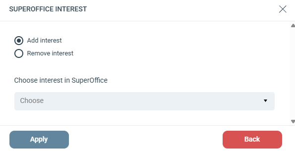

# Lägg till / Ta bort intresse

Lägger till eller tar bort en intressekod från en kontakt i SuperOffice. Intressen finns på fliken Intressen på kontaktkortet i SuperOffice.

## Inställningar

Välj mellan **Add interest** eller **Remove interest**.

**Choose interest in SuperOffice:** Välj ett intresse från rullgardinsmenyn. Alternativen baseras på de tillgängliga intressena i ditt anslutna SuperOffice-konto.
