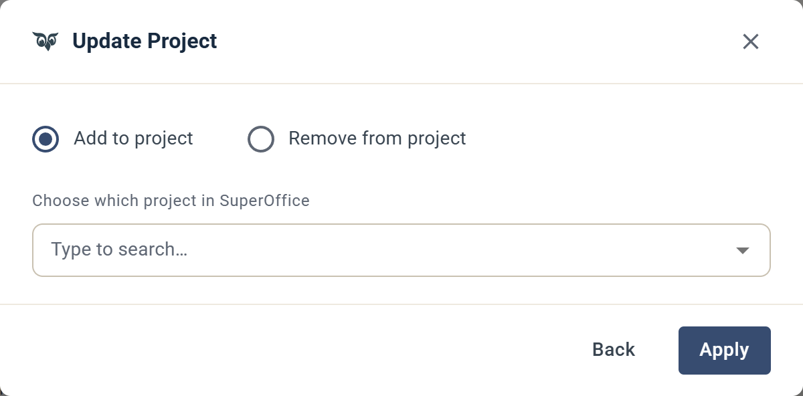

# Lägg till / Ta bort från projekt

Lägger till eller tar bort en kontakt från ett projekt i SuperOffice.

## Inställningar

Välj mellan **Add to project** eller **Remove from project**.

**Choose which project in SuperOffice:** Sök efter ett projekt i ditt anslutna SuperOffice-konto och välj det.
