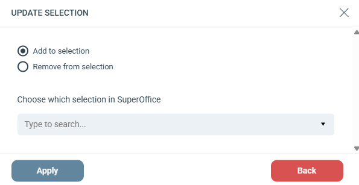

# Lägg till / Ta bort från urval

Lägger till eller tar bort en kontakt från ett urval i SuperOffice.

## Inställningar

Välj mellan **Add to selection** eller **Remove from selection**.

**Choose which selection in SuperOffice:** Sök efter ett urval i ditt anslutna SuperOffice-konto och välj det.


Dynamiska SuperOffice-urval fungerar som sparade sökningar och innehåller ingen fast lista med kontakter. Du kan bara lägga till eller ta bort kontakter från statiska urval.

