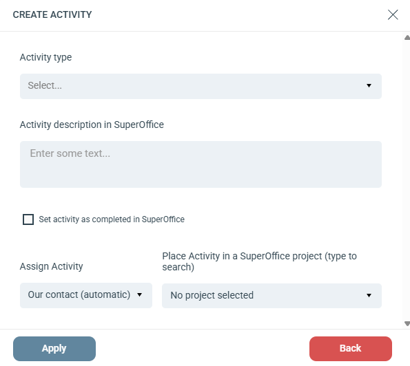

# Skapa aktivitet

## Inställningar

**Activity type:** Anger aktivitetstypen. Välj bland de tillgängliga aktivitetstyperna i ditt anslutna SuperOffice-konto.

**Activity description in SuperOffice:** En beskrivning för aktiviteten. Skriv @ för att infoga personaliserade kopplingsfält. Beskrivningen visas även i kolumnen **Text** på fliken Aktiviteter för kontakter och företag i SuperOffice.

**Set activity as completed in SuperOffice:** Välj om aktiviteten ska skapas som slutförd. En ej slutförd aktivitet är mer synlig för den tilldelade SuperOffice-användaren.

**Assign Activity:** Tilldela aktiviteten till en specifik SuperOffice-användare, eller använd det dynamiska alternativet **Our contact**. Our contact är den användare som är tilldelad kontaktens företag under fältet Our contact på SuperOffice-företagskortet.

**Place Activity in a SuperOffice project:** Tilldela ett projekt för att lägga till både aktiviteten och kontakten i ett SuperOffice-projekt.
