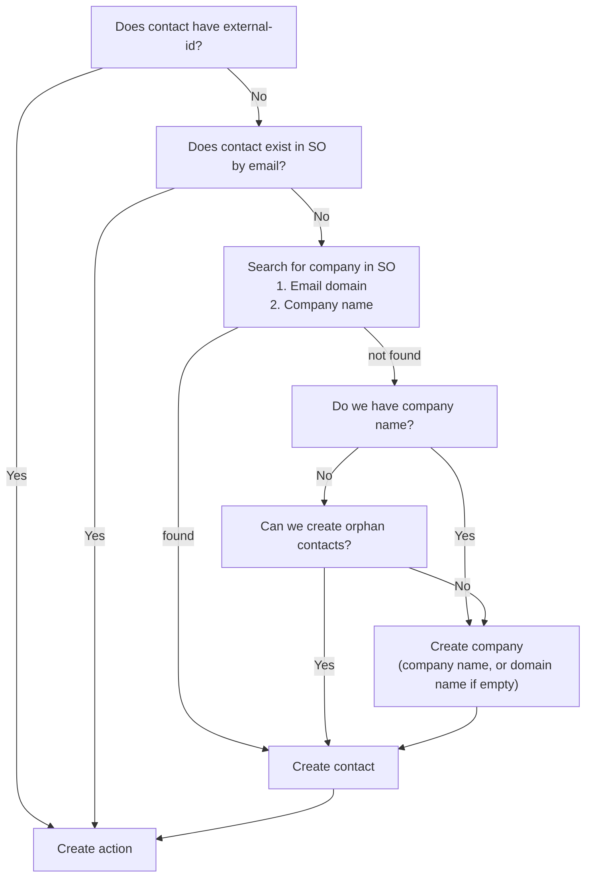

# Kontaktmatchning i SuperOffice

När ett Journey-steg utför en uppgift i SuperOffice måste eMarketeer först hitta kontakten i SuperOffice. Den här artikeln förklarar hur kontakter matchas och hur du kan skapa de kontakter som saknas.

Det gäller stegen i gruppen CRM i panelen "Add Journey step": Create Activity, Create Sale, Add / Remove from project, Add / Remove from selection och Add / Remove interest. Se [SuperOffice Journey Steps](superoffice-journey-steps.md).

## Kontaktmatchning

När en uppgift utförs i SuperOffice kontrollerar eMarketeer först om kontakten finns där. Det görs genom att matcha kontaktens external-id och e-postadress.

Om ingen matchande kontakt hittas hoppas Journey-steget över som standard.

## Skapa saknade kontakter i SuperOffice

När du lägger till ett Journey-steg som involverar SuperOffice visas en inställningspanel i det vänstra sidofältet.

Som standard hoppas kontakter som inte hittas i SuperOffice över. Du kan också konfigurera steget så att det automatiskt skapar de saknade kontakterna i SuperOffice.

För att skapa kontakterna i SuperOffice måste du också ange en ansvarig säljare och en kategori för de nya kontakterna och företagen.

När kontakter och företag skapas automatiskt försöker eMarketeer hitta ett befintligt företag som passar den nya kontakten, eller skapar kontakten utan företag om det är tillåtet.

Inställningen för att skapa kontakter gäller alla SuperOffice-steg i din Journey.

Logik för kontaktmatchning

**Tips:** När du aktiverar automatiskt skapande av kontakter är det bra praxis att även lägga till de nya kontakterna i ett urval i SuperOffice. På så sätt hittar du dem enkelt senare.
