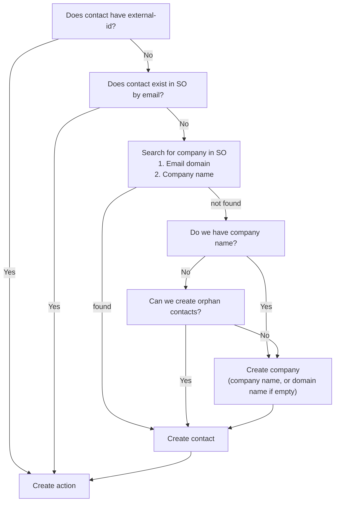

# Så matchas kontakter mellan eMarketeer och SuperOffice

Den här artikeln förklarar hur eMarketeer kopplar en kontakt till samma person i SuperOffice, och hur varje del av integrationen hittar rätt kontakt.

eMarketeer och SuperOffice har separata databaser. En kontakt i eMarketeer kopplas till sin motsvarighet i SuperOffice via **External ID**. Om kontakten ännu inte har något External ID matchas den på e-postadress.

## External ID

External ID är ett fält på kontakten i eMarketeer som kopplar den till kontaktens post i ett anslutet CRM. Det är inte specifikt för SuperOffice: med Microsoft Dynamics 365 kan det till exempel innehålla kontakt-ID:t i Dynamics. Med SuperOffice innehåller det personens **Contact ID** i SuperOffice.

SuperOffice använder två liknande ID:n, så var noga med att inte blanda ihop dem. **Contact ID** identifierar personen (`person_id` i SuperOffice-databasen), och **Company ID** identifierar företaget (`contact_id` i databasen). External ID är alltid personens Contact ID.

Du kan inte redigera External ID på en enskild kontakt. För att sätta eller uppdatera det [importerar du kontakterna från SuperOffice](import-contacts-from-superoffice-crm.md). Importen matchar på e-postadress och sparar varje kontakts Contact ID.

Du kan också sätta External ID med en [import från Excel](../../knowledge-base/contacts-lists/import-contacts-from-excel.md) genom att mappa en kolumn till **External ID**, men import från SuperOffice är det rekommenderade sättet. Om du använder Excel, se till att kolumnen innehåller personens Contact ID och inte Company ID.

## När External ID sätts

* **Import från SuperOffice** — Importen matchar alltid på e-postadress och uppdaterar varje kontakt i eMarketeer med den e-postadressen, inklusive External ID. Om flera kontakter i eMarketeer har samma e-postadress får de alla identiska uppgifter, inklusive samma External ID.
* **Share to CRM** — När du delar en kontakt till SuperOffice skapas kontakten där, eller matchas mot en befintlig kontakt på e-postadress. Contact ID sparas sedan som External ID.
* **Lead Board** — När en kontakt blir en MQL söker eMarketeer i SuperOffice på e-postadress, använder den första träffen och sparar dess Contact ID. Se [Lead Board för SuperOffice](../../knowledge-base/lead-board-scoring/lead-board-and-superoffice.md).
* **Journeys** — SuperOffice-stegen i en Journey matchar kontakten på e-postadress, eller skapar den i SuperOffice om du tillåter det, och sparar Contact ID.
* **Import från Excel** — En kolumn som mappas till **External ID**, som beskrivs ovan.

## Så hittar varje arbetsflöde kontakten i SuperOffice

### SuperOffice-automatiseringar

[SuperOffice-automatiseringar](../../knowledge-base/integrations/superoffice-automations-pro.md) i en kampanj behöver External ID. Utan det pausas automatiseringen och kontakten läggs i Manage Automations Queue tills kontakten har matchats eller delats till SuperOffice. Om External ID inte matchar någon kontakt i SuperOffice misslyckas automatiseringen. Se [Varför misslyckades SuperOffice-automatiseringen?](../../knowledge-base/integrations/integration-queue-failed-automations.md).

### Journey-steg

Stegen i gruppen **CRM** i panelen **Add Journey step** använder först External ID. Om kontakten inte har något letar eMarketeer efter kontakten i SuperOffice på e-postadress. Om ingen matchande kontakt hittas hoppas Journey-steget över som standard. Se [SuperOffice Journey Steps](superoffice-journey-steps.md).

## Skapa saknade kontakter i SuperOffice

När du lägger till ett Journey-steg som involverar SuperOffice visas en inställningspanel i det vänstra sidofältet.

Som standard hoppas kontakter som inte hittas i SuperOffice över. Du kan också konfigurera steget så att det automatiskt skapar de saknade kontakterna i SuperOffice.

För att skapa kontakterna i SuperOffice måste du också ange en ansvarig säljare och en kategori för de nya kontakterna och företagen.

När kontakter och företag skapas automatiskt försöker eMarketeer hitta ett befintligt företag som passar den nya kontakten, eller skapar kontakten utan företag om det är tillåtet.

Inställningen för att skapa kontakter gäller alla SuperOffice-steg i din Journey.

Logik för kontaktmatchning


När du aktiverar automatiskt skapande av kontakter är det bra praxis att även lägga till de nya kontakterna i ett urval i SuperOffice. På så sätt hittar du dem enkelt senare.

