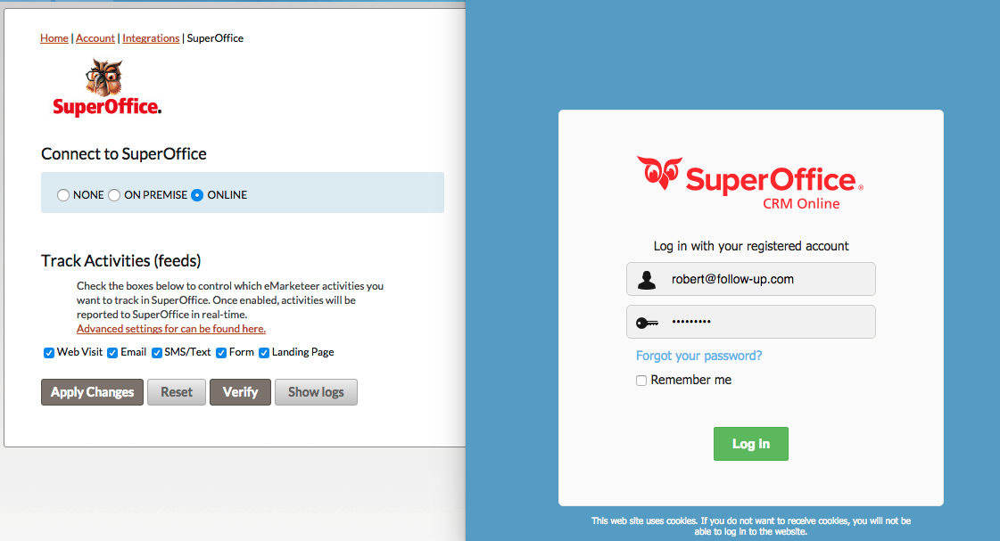

# SuperOffice Online-integration

Den här artikeln går igenom hur du ansluter SuperOffice Online till eMarketeer.

## Krav

- Ett SuperOffice Online-konto (Sales- och Complete CRM-versionerna stöds)
- Ett eMarketeer-konto

## Åtgärder som utförs vid uppsättning

För att integrationen ska fungera korrekt installerar eMarketeer nya objekt i SuperOffice, inklusive webbpaneler, fält och typer. [Läs mer om dessa åtgärder](https://support.emarketeer.com/documentation/actions-performed-during-set-up/).

## Starta integrationen

För att starta integrationen, logga in i eMarketeer och klicka på "Account" och sedan "Plugins and Integrations". Därifrån hittar du inställningssidan för SuperOffice.

1. Välj radioknappen Online och klicka på "Apply changes".
2. En popup med SuperOffice inloggningsskärm visas. Fyll i din inloggning och klicka på "Log in" för att autentisera.
3. Vänta medan integrationen slutförs.
