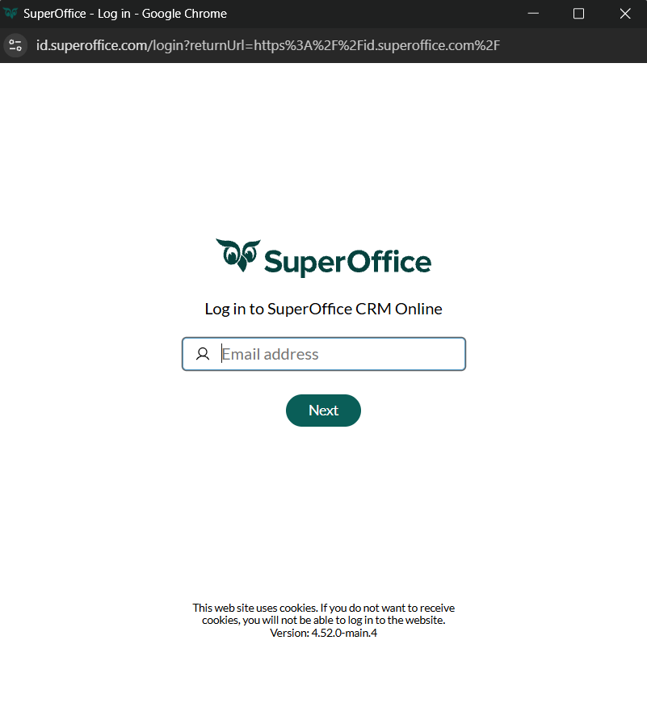

# SuperOffice Online-integration

## Krav

* Ett SuperOffice Online-konto (Sales- och Complete CRM-versionerna stöds)
* Ett eMarketeer-konto

## Åtgärder som utförs vid uppsättning

För att integrationen ska fungera korrekt installerar eMarketeer nya objekt i SuperOffice, inklusive webbpaneler, fält och typer. [Läs mer om dessa åtgärder](actions-performed-during-set-up.md).

## Starta integrationen

För att starta integrationen, logga in i eMarketeer, klicka på kugghjulsikonen uppe till höger, välj "Account Settings", öppna "Integrations" och klicka på "Manage" på kortet SuperOffice CRM. Därifrån hittar du inställningssidan för SuperOffice.

1. Välj **Online** och klicka på **Apply Changes**.
2. En popup med SuperOffice inloggningsskärm visas. Ange din e-postadress, klicka på **Next** och följ stegen för att logga in.

   

3. Vänta medan integrationen slutförs.
