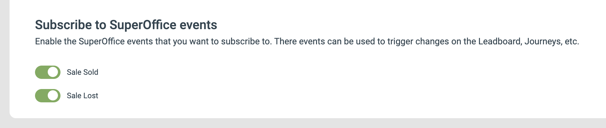

# SuperOffice Signals

SuperOffice kan skicka vissa händelser till eMarketeer som Signals, så att du kan lyssna efter dessa händelser och agera på dem i eMarketeer.

Alla Signals som skickas till eMarketeer kan användas för att:

* Hitta kontakter i ett kontaktfilter, inklusive filtrering på specifika värden i signalen
* Trigga Journeys när signalen kommer in
* Generera leads på Lead Board
* Sätta Lead Score för signalen

## Prenumerera på SuperOffice-händelser

För att prenumerera på SuperOffice-händelser, öppna SuperOffice-integrationssidan i eMarketeer. Längst ned på inställningssidan hittar du de händelser du kan prenumerera på.

Slå på reglagen för de händelser du vill att SuperOffice ska skicka till eMarketeer.

Om kontaktens e-postadress i en mottagen händelse inte finns i eMarketeer skapas kontakten.

## Sale Sold

Den här händelsen skickas till eMarketeer när en försäljning stängs som "Sold" i SuperOffice. Data som skickas till eMarketeer är:

* E-postadress (för den relaterade kontakten i försäljningen)
* Sale ID
* Sale name
* Sale Type
* Sale value

Exempel på användningsfall:

* Flytta en lead på Lead Board till "Won" när en försäljning stängs i SuperOffice
* Skicka ett tack-mejl till en ny kund
* Sätt kontaktens status till kund

## Sale Lost

Den här händelsen skickas till eMarketeer när en försäljning stängs som "Lost" i SuperOffice. Data som skickas till eMarketeer är:

* E-postadress (för den relaterade kontakten i försäljningen)
* Sale ID
* Sale name
* Sale Type
* Sale value

Exempel på användningsfall:

* Flytta leaden till "Lost" på Lead Board
* Tagga kontakten som en förlorad försäljning för framtida win-back-kampanjer

## Sale Created

Den här händelsen skickas till eMarketeer när en försäljning skapas i SuperOffice. Data som skickas till eMarketeer är:

* E-postadress (för den relaterade kontakten i försäljningen)
* Sale ID
* Sale name
* Sale Type
* Sale value

Exempel på användningsfall:

* Starta en nurturing-Journey för en nyligen skapad försäljning

## Contact Created

Den här händelsen skickas till eMarketeer när en kontakt skapas i SuperOffice. Data som skickas till eMarketeer är:

* E-postadress (för den skapade kontakten)
* Signal ID (`New Contact Created`)

Exempel på användningsfall:

* Skicka ett meddelande om dataskydd till nya kontakter
