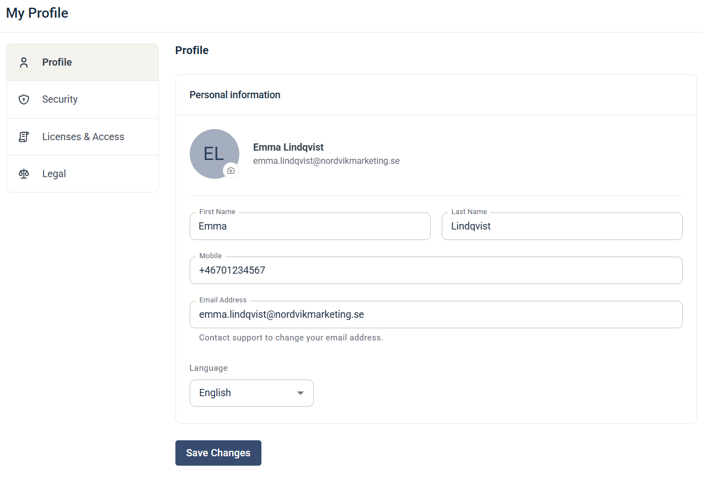

# Redigera din profil

Din profil innehåller dina personuppgifter, ditt språk och dina säkerhetsinställningar för inloggning.

Öppna den genom att klicka på din avatar uppe till höger och välja **My Profile**.

## Profile

På fliken **Profile** kan du ändra:

* **Namn** — ditt för- och efternamn.
* **Profilbild** — klicka på kameraikonen på din avatar för att ladda upp en bild.
* **Mobile** — ditt mobilnummer.
* **Language** — språket i eMarketeer-applikationen. Du kan välja svenska, engelska, finska, norska eller danska.

Klicka på **Save Changes** när du är klar.

Kontakta supporten om du vill ändra din e-postadress.

Bara du kan ändra din profilbild. Den visas för andra användare på kontot, till exempel på Lead Board och i anteckningar.

## Security

På fliken **Security** kan du:

* **Återställa ditt lösenord** — klicka på **Send reset email**. Du får ett e-postmeddelande med instruktioner för att ändra ditt lösenord.
* **Slå på multifaktorautentisering** — om ditt konto inte redan kräver det kan du slå på multifaktorautentisering för din egen användare. Se [Multi-factor authentication](../documentation/accounts-auth/multi-factor-authentication.md). Stegen för att ställa in det finns i [Användarguide: Aktivera Multi-Factor-inloggning](../knowledge-base/account-admin/user-accounts.md).

### Ditt EMID

Fliken Security visar också din **My Identifier Code (EMID)**. Ett annat konto behöver den för att kunna överföra en kampanj till dig. Klicka på kopieringsikonen för att kopiera koden. Se [Överför en kampanj till ett annat konto](../knowledge-base/campaigns/transfer-a-campaign-to-a-different-account.md).

