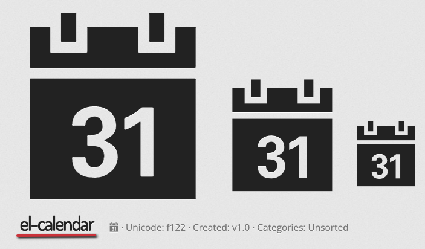
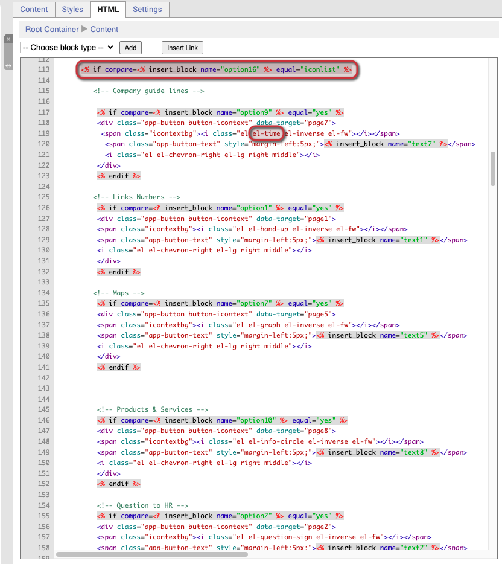
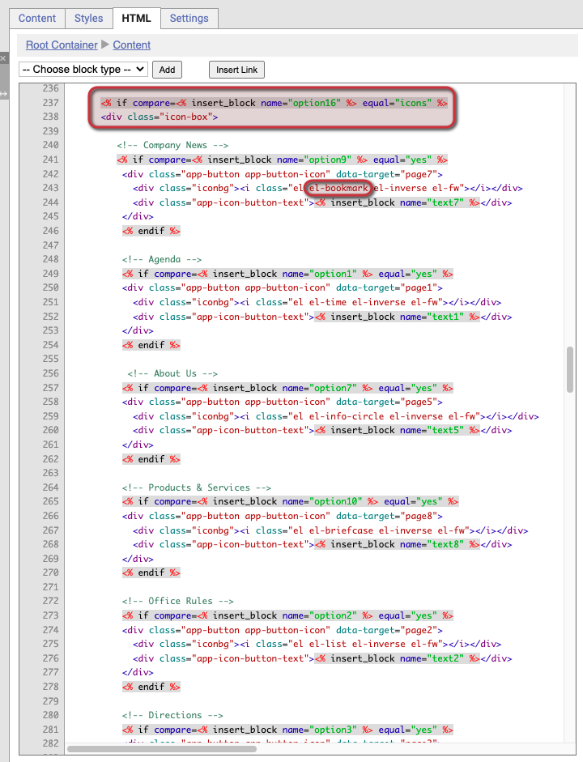

# Ändra navigeringsikoner i mobilappen (Developer)

Den här guiden visar hur du byter ikoner i navigeringsmenyn i en mobilappskomponent.

Navigeringsmenyn använder ikoner från [Elusive Icons](https://elusiveicons.com/icons/). Du kan byta ut dem mot någon av de 300+ tillgängliga ikonerna genom att redigera appens HTML. Du behöver Developer-behörighet på ditt användarkonto för att göra dessa ändringar.



### Välj vilka ikoner du vill använda

Bläddra i ikonlistan på [elusiveicons.com](https://elusiveicons.com/icons/) och välj de ikoner du vill ha.

[

](https://downloads.intercomcdn.com/i/o/467403408/8cf83dfe3a6ecf908c2b9a64/app-elusiveicons-list.png)

Listsidan för Elusive Icons



### Slå upp ikonens tagg

Klicka på den ikon du vill använda. Leta efter ikonens el-tag — ikonnamnet som börjar med "el-". Till exempel har kalenderikonen taggen `el-calendar`. Notera taggen — du klistrar in den i HTML i ett senare steg.

[

](https://downloads.intercomcdn.com/i/o/467404444/50ba922f497aa71733a15555/app-elusiveicons-iconcode.png)

Sidan för kalenderikonen på Elusive Icons



### Kontrollera vilken stil på navigeringsmenyn som används

I eMarketeer kontrollerar du vilken stil din app använder för navigeringsmenyn. Inställningen heter **Navigation Menu** och finns högst upp på fliken Settings för Content-blocket.

Plats för Navigation Menu-inställningen på fliken Content Settings

Det finns tre stilar för navigeringsmenyn: Icons, Icon List och List. Notera vilken du använder — du behöver bara ändra ikoner för den stilen.

De tre alternativen för navigeringsmenystil



### Öppna HTML-fliken

På mobilappskomponentens redigeringssida klickar du på **Enable Developer Mode** i verktygsmenyn till vänster, öppnar **Colors, Fonts & Head** och växlar till fliken **HTML** i menyn till höger.

Om du inte ser länken Developer Mode, be en kontoadministratör att ge ditt användarkonto Developer-behörighet.

[

](https://downloads.intercomcdn.com/i/o/467405809/2a5e2703535471d490640f41/app-html-tab.png)

Navigering till HTML-fliken i Developer Mode



### Hitta ikonen i HTML-koden

HTML-fliken har två ställen där ikoner definieras. Ett styr navigeringsstilen **Icon List** och det andra styr stilen **Icons**.

Den översta delen av HTML-koden märker varje sektion som `iconlist` eller `icons`. Varje navigeringsikon har sin egen undersektion. Leta där efter el-taggen för ikonen som används just nu, till exempel `el-time` eller `el-bookmark`.

#### Iconlist HTML

[

](https://downloads.intercomcdn.com/i/o/467437532/3f94673815295cdcc491f545/app-iconlist.png)

Plats för iconlist-ikonkoden i HTML (vanligtvis nära rad 113)

#### Icons HTML

[

](https://downloads.intercomcdn.com/i/o/467437560/786013c0d589590cb65d0126/app-icons.png)

Plats för icons-ikonkoden i HTML (vanligtvis nära rad 237)



### Byt ut ikontaggen och spara

Ändra den befintliga el-taggen till den nya för din valda ikon och spara HTML-koden. För att till exempel ändra "Company News" från en bokmärkesikon till en kalenderikon byter du ut `el-bookmark` mot `el-calendar`. Låt taggarna runt omkring vara — `el`, `el-inverse` och `el-fw` är desamma för alla ikoner i appkomponenten.


