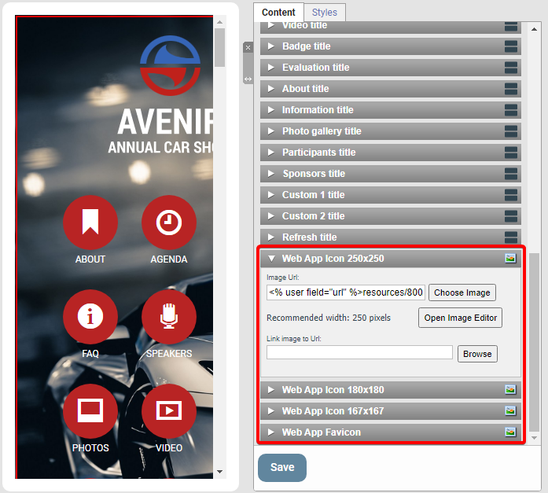
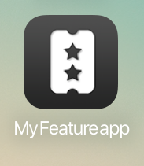
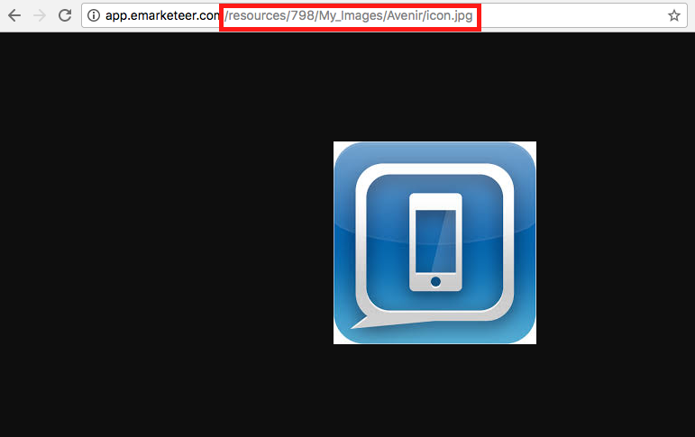

# Byt ikon för hemskärm i Web App

Ersätt eMarketeers standardikon med din egen när du sparar en Web App på en mobil hemskärm.

Den här artikeln gäller endast äldre Web App-mallar. Uppdaterade versioner av appen har en inbyggd bildväljare för Web App-ikoner och favicons i inställningsblocket, enligt nedan.

Fält för Web App-ikon

När du sparar din Web App på mobilens hemskärm används eMarketeers logotyp som standardikon, enligt nedan.

Följ stegen nedan för att använda en egen ikon.

## Skapa en egen ikon

Skapa en kvadratisk bild som är minst 254 pixlar bred och hög, och högst 1024. Spara bilden som PNG eller JPG.

> TODO: verify — original lists "png, jpg or png format" which is a typo; confirm the supported formats.

## Ladda upp bilden till eMarketeer och hämta URL

Gå till Files i eMarketeer och ladda upp bilden till valfri mapp. Klicka för att förhandsgranska bilden och kopiera den relativa URL:en (utan domännamnet), enligt nedan.

## Klistra in den nya URL:en i Web App-headern

Öppna din Web App i developer mode och ändra ikonens URL:er.

1. Aktivera developer mode. Om du inte ser det här alternativet, be administratören att ge dig behörigheten.
2. Klicka på Colors, Fonts & Head i menyn till vänster.
3. Klicka på fliken Head.
4. På rad 9–12 klistrar du in din nya URL på alla fyra raderna.
5. Klicka på Save.

Din app använder nu den nya ikonen när den sparas på en hemskärm.
