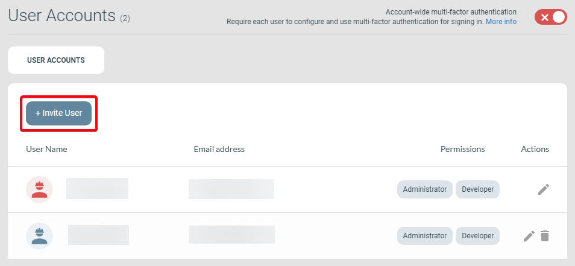

---
description: >-
  Hur administratörer bjuder in en ny användare till ett eMarketeer-konto från sidan Användarkonton under Inställningar.
---

# Så bjuder du in användare till ditt konto (administratör)

Den här guiden visar administratörer hur de bjuder in en ny användare till sitt eMarketeer-konto.

Om du inte hittar inställningssidan User Accounts saknar du behörighet att bjuda in eller skapa användare. Kontakta en administratör på ditt konto eller teknisk support för hjälp.

## Öppna inställningarna för User Accounts

Navigera till inställningssidan User Accounts via Company Account Settings.

Sidan Account Settings

## Skicka inbjudan

På sidan User Accounts klickar du på Invite User för att starta inbjudningsprocessen.

Knappen Invite User

Då öppnas sidan Create New User. Ange den nya användarens e-postadress, välj behörigheter och skicka inbjudningsmejlet.

- Developer: kan använda Developer Mode i komponenter för avancerad anpassning.
- Administrator: kan använda Corporate Account Settings och bjuda in användare till kontot.

Sidan Create New User

Inbjudningsmejlet innehåller en länk till en sida där användaren kan skapa sitt konto, om de inte redan har ett. Om de redan har ett användarkonto på ett annat konto får de tillgång till det nya kontot utöver de befintliga.
