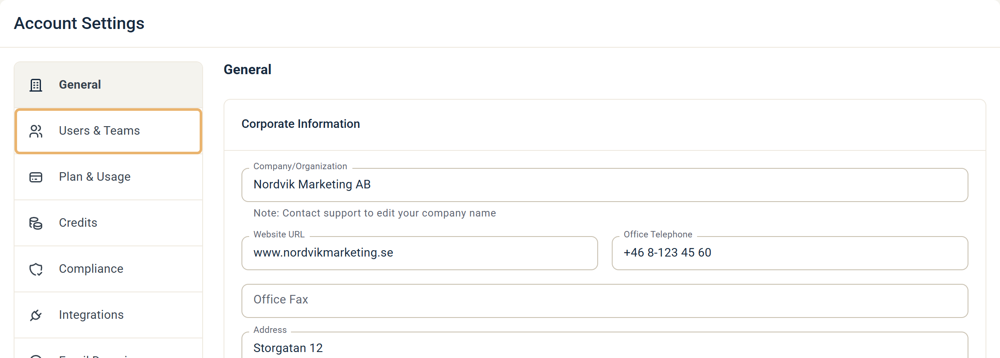
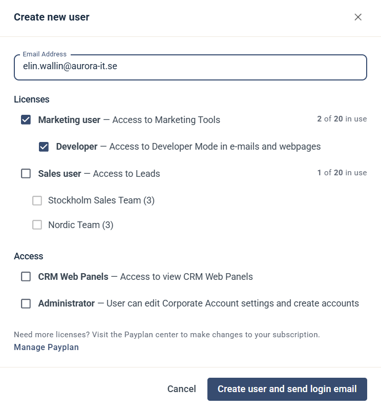

# Så bjuder du in användare till ditt konto (administratör)

Den här guiden visar administratörer hur de bjuder in en ny användare till sitt eMarketeer-konto.

Om du inte hittar Users & Teams i Account Settings saknar du behörighet att bjuda in eller skapa användare. Kontakta en administratör på ditt konto eller teknisk support för hjälp.

## Öppna Users & Teams

Klicka på kugghjulsikonen uppe till höger, välj Account Settings och öppna Users & Teams. Fliken User Accounts listar dina användare.

## Skicka inbjudan

På fliken User Accounts klickar du på Create User för att starta inbjudningsprocessen.

Då öppnas dialogrutan Create new user. Ange den nya användarens e-postadress, välj licenser och åtkomst och klicka på Create user and send login email.

### Licenser

* **Marketing user**: åtkomst till marknadsföringsverktygen, till exempel kampanjer och journeys. En marketing user kan se Lead board, men kan inte tilldelas leads eller arbeta med dem.
  * **Developer**: en roll för marketing users, inte en egen licens. Den ger åtkomst till Developer Mode i e-postmeddelanden och landningssidor. Bara developers kan skapa och uppdatera komponentmallar.
* **Sales user**: åtkomst till Lead board för att arbeta med leads. En sales user måste tilldelas ett säljteam. Dina säljteam listas under Sales user i dialogrutan. Markera det eller de team som användaren tillhör.

Dialogrutan visar hur många licenser av varje typ som används. Om du behöver fler klickar du på Manage Payplan.

### Åtkomst

* **CRM Web Panels**: åtkomst till eMarketeers webbpaneler i ditt CRM-verktyg, till exempel Contact Summary och Company Summary. För SuperOffice, se [Webbpaneler](../../documentation/superoffice/integration-features-and-flows.md#webbpaneler) i artikeln om SuperOffice-integrationens funktioner och flöden.
* **Administrator**: kan redigera kontoinställningarna och bjuda in nya användare.

Inbjudningsmejlet innehåller en länk till en sida där användaren kan skapa sitt konto, om de inte redan har ett. Om de redan har ett användarkonto på ett annat konto får de tillgång till det nya kontot utöver de befintliga.
