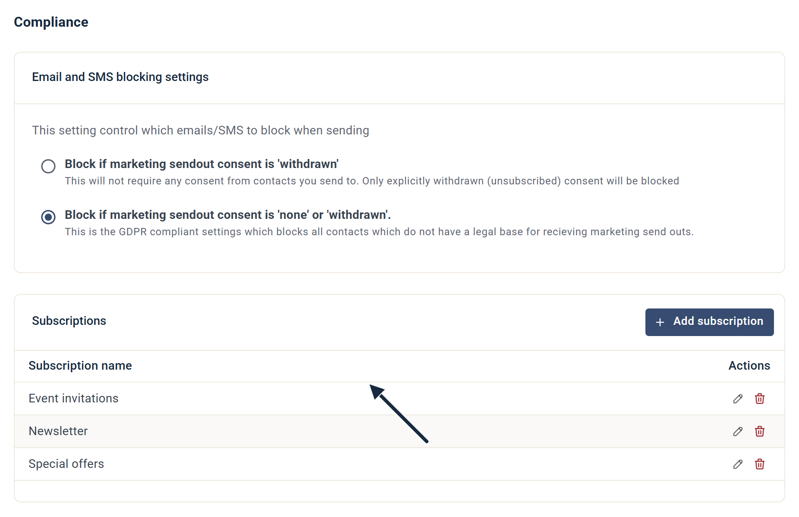
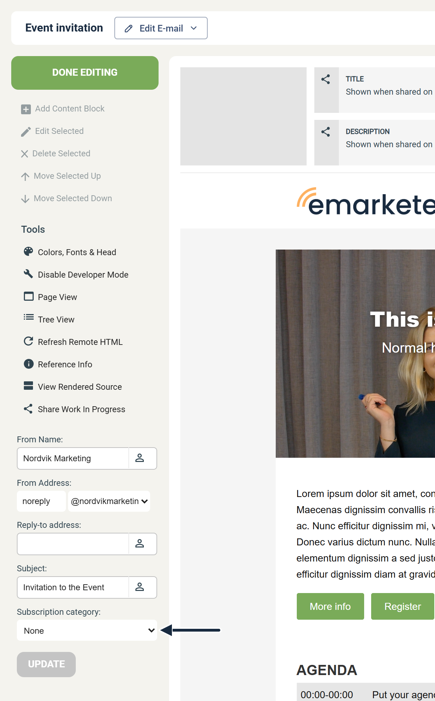

# Prenumerationer

Prenumerationer ger kontakter möjlighet att välja vilka typer av e-post de vill ta emot, så att de kan avsluta prenumerationen på specifika kategorier i stället för att avsluta alla utskick. Det minskar vanligtvis antalet fullständiga avprenumerationer.

Du organiserar dina utskick i kategorier — till exempel Nyhetsbrev, Eventinbjudningar eller Specialerbjudanden. När du skickar utesluter eMarketeer automatiskt kontakter som har avprenumererat från den kategorin. En e-post utan tilldelad kategori filtreras bara för kontakter som har återkallat sitt marknadsföringsmedgivande helt.

## Konfigurera prenumerationskategorier

Du behöver administratörsbehörighet för att skapa och hantera prenumerationskategorier.

1. Klicka på kugghjulsikonen uppe till höger och välj **Account Settings**.
2.  Öppna **Compliance** i vänstermenyn. Prenumerationskategorierna listas under **Subscriptions**.

    

3.  Klicka på **Add subscription** för att skapa en kategori. Håll namnen korta och tydliga — kontakter ser dem i prenumerationscentret. Fokusera på breda kommunikationstyper snarare än mycket specifika.

    

## Dina kontakter

Alla kontakter — nya och befintliga — börjar med alla prenumerationskategorier aktiverade. Om du vill ändra prenumerationsinställningarna för en grupp kontakter på en gång, använd massuppdateringsåtgärden på en kontaktlista.

## Skapa en e-post

När du lägger till en ny e-post öppnar du **Advanced settings** i dialogen Add Email. Där hittar du rullgardinsmenyn **Subscription category**. Välj den kategori som bäst matchar e-postens innehåll.

Om e-posten inte tillhör någon kategori — till exempel ett engångsmeddelande — ställer du in den på **None**. E-post inställda på None filtreras bara för kontakter som har avprenumererat helt.

## Prenumerationscenter

Prenumerationscentret är en offentlig sida där kontakter hanterar sina e-postpreferenser. Det listar alla aktiva kategorier, var och en med en växel. Kontakter kan också markera en ruta för att avsäga sig alla utskick och återkalla sitt marknadsföringsmedgivande.

Standardlänken för avprenumeration i e-postsidfötter länker automatiskt till prenumerationscentret.

## Automationer

Du kan ändra en kontakts prenumerationsstatus automatiskt med kampanjautomationer. Öppna fliken **Automation** i en kampanj och skapa en automation som utlöses när en kontakt interagerar med en komponent — till exempel för att ta bort dem från en kategori efter att de klickat på en specifik länk.

***

**Relaterat:**

* [Exkludera inaktiva mottagare](../../../documentation/email-sms/exclude-inactive-recipients.md)
* [Transaktionella utskick](../../../documentation/email-sms/transactional-sendouts.md)
* [Vitlista e-postservrar](../../../documentation/email-sms/whitelisting-email-servers.md)
* [Automatisk avsändarpaus](../../../documentation/email-sms/automatic-send-pause.md)
