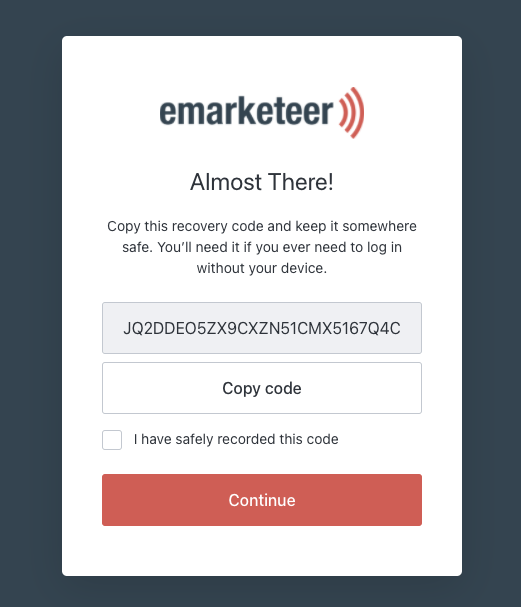

# Användarguide: Aktivera Multi-Factor-inloggning

Konfigurera Multi-Factor Authentication (MFA) för din eMarketeer-inloggning i tre steg med en authenticator-app. För bakgrund om MFA, se [den här artikeln](../../documentation/accounts-auth/multi-factor-authentication.md).

### Ladda ner en authenticator-app

Innan du börjar, installera en authenticator-app på din mobila enhet om du inte redan har en. Vi rekommenderar Google Authenticator eller Twilio Authy. Använd länkarna nedan eller sök i din app store.

#### Google Authenticator

 [

](https://play.google.com/store/apps/details?id=com.google.android.apps.authenticator2) [

](https://apps.apple.com/se/app/google-authenticator/id388497605)

#### Twilio Authy 2-Factor Authentication

 [

](https://play.google.com/store/apps/details?id=com.authy.authy) [

](https://apps.apple.com/us/app/twilio-authy/id494168017)

## Konfigurera MFA

Följ stegen nedan efter att du eller din admin har aktiverat MFA på ditt konto. Du kan också aktivera det själv i eMarketeer under Settings → Edit my profile → slå på MFA.

## 1. Gå till inloggningssidan för eMarketeer

Ange ditt användarnamn och lösenord. Om MFA är aktiverat ser du en knapp "Activate MFA". Klicka på den.

## 2. Konfigurera appen

En QR-kod visas. Öppna din authenticator-app på telefonen och tryck på "Scan QR code". Skanna QR-koden på datorskärmen. Appen visar en sexsiffrig kod — ange den på datorskärmen och klicka på "Continue".

## 3. Spara återställningskoden

Du är nu autentiserad, men innan du fortsätter får du en återställningskod. Använd den koden för att logga in om du inte har din telefon med authenticator-appen. Spara den på ett säkert ställe. Markera kryssrutan för att bekräfta att du har sparat den och klicka sedan på "Continue".

## Nästa gång du loggar in

Nästa gång du loggar in ser du en uppmaning "Verify your identity". Öppna din authenticator-app, läs av den sexsiffriga koden och ange den på inloggningsskärmen. Markera kryssrutan för att eMarketeer ska komma ihåg den här enheten i 30 dagar, så du inte behöver appen vid varje inloggning.

Om du får problem med inloggningen, kontakta supporten via chattrutan på inloggningssidan.
