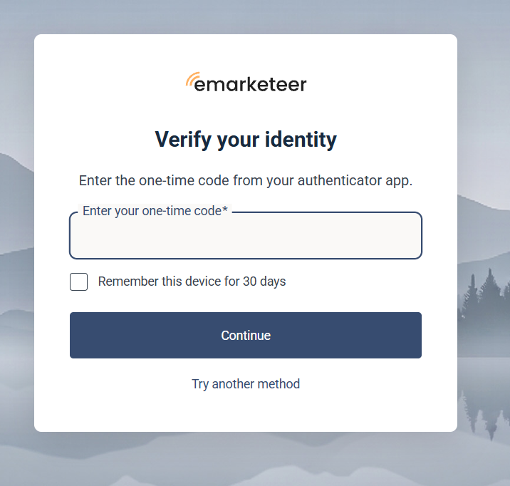

# Användarguide: Aktivera Multi-Factor-inloggning

Konfigurera Multi-Factor Authentication (MFA) för din eMarketeer-inloggning i tre steg med en authenticator-app. För bakgrund om MFA, se [den här artikeln](../../documentation/accounts-auth/multi-factor-authentication.md).

### Ladda ner en authenticator-app

Innan du börjar, installera en authenticator-app på din mobila enhet om du inte redan har en. Vi rekommenderar Google Authenticator eller Twilio Authy. Använd länkarna nedan eller sök i din app store.



#### Google Authenticator

 



#### Twilio Authy 2-Factor Authentication

 



## Konfigurera MFA

Följ stegen nedan efter att du eller din admin har aktiverat MFA på ditt konto. Du kan också aktivera det själv i eMarketeer: klicka på din avatar uppe till höger, välj **My Profile**, öppna fliken **Security** och slå på **Multi-factor authentication**.



### Gå till inloggningssidan för eMarketeer

Ange ditt användarnamn och lösenord. Om ditt konto kräver MFA visar skärmen **Select account** en knapp **Activate MFA**. Klicka på den.




### Konfigurera appen

En QR-kod visas. Öppna din authenticator-app på telefonen och tryck på "Scan QR code". Skanna QR-koden på datorskärmen. Appen visar en sexsiffrig kod — ange den på datorskärmen och klicka på "Continue".




### Spara återställningskoden

Du är nu autentiserad, men innan du fortsätter får du en återställningskod. Använd den koden för att logga in om du inte har din telefon med authenticator-appen. Spara den på ett säkert ställe. Markera kryssrutan för att bekräfta att du har sparat den och klicka sedan på "Continue".




## Nästa gång du loggar in

Nästa gång du loggar in ser du en uppmaning "Verify your identity". Öppna din authenticator-app, läs av den sexsiffriga koden och ange den i fältet **Enter your one-time code**. Markera **Remember this device for 30 days** om du inte vill använda appen vid varje inloggning, och klicka sedan på **Continue**.

Om du inte har telefonen med dig klickar du på **Try another method**. Välj **Recovery code** och logga in med din återställningskod.

Om du får problem med inloggningen, kontakta supporten via chattrutan på inloggningssidan.
