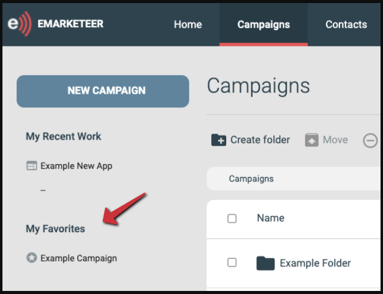
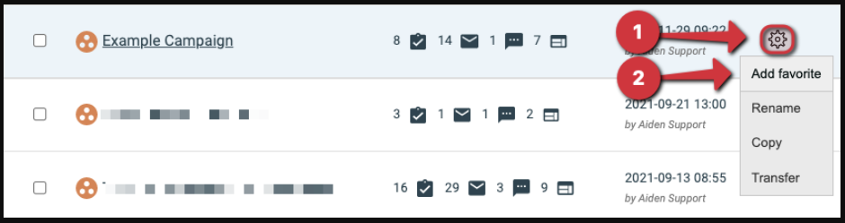

# Skapa en genväg till en kampanj med Mina favoriter

Mina favoriter är en sektion i kampanjnavigeringen som innehåller genvägar till kampanjer du vill nå snabbt.

Använd den för att fästa kampanjer du besöker ofta eller som är aktiva just nu, så att de är ett klick bort från varje kampanjnavigeringssida.

Plats för Mina favoriter på kampanjnavigeringssidorna

## Lägg till en kampanj i Mina favoriter

1. Navigera till kampanjen i kampanjstrukturen.
2. Klicka på kugghjulsikonen till höger om kampanjens rad.
3. Klicka på Add Favorite i kontextmenyn.

Lägga till en kampanj i Favoriter
