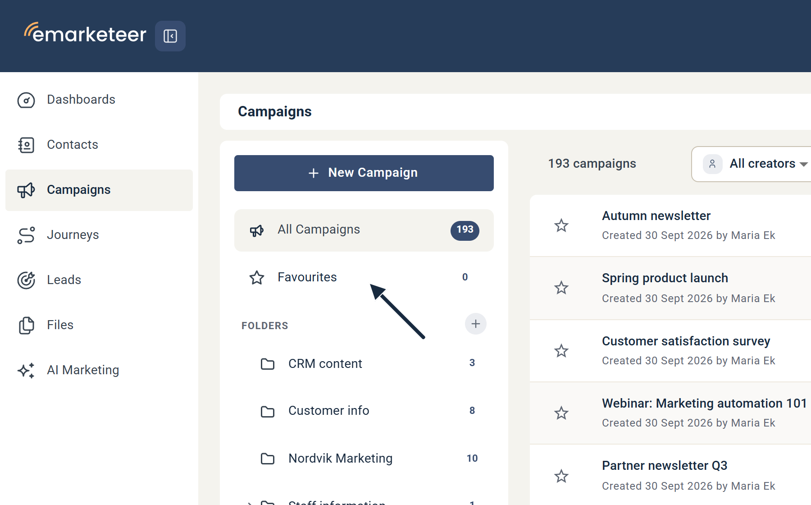
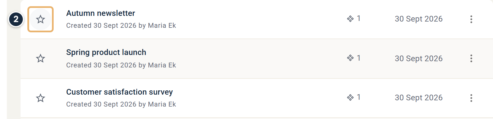

# Skapa en genväg till en kampanj med Favourites

Favourites är en sektion i den vänstra panelen på kampanjsidan Campaigns som innehåller genvägar till kampanjer du vill nå snabbt.

Använd den för att fästa kampanjer du besöker ofta eller som är aktiva just nu, så att de är ett klick bort på sidan Campaigns.

Plats för Favourites på sidan Campaigns

## Lägg till en kampanj i Favourites

1. Hitta kampanjen i kampanjlistan, under All Campaigns eller i sin mapp.
2. Klicka på stjärnikonen till vänster i kampanjens rad.

Kampanjen visas nu under Favourites.

Lägga till en kampanj i Favourites
