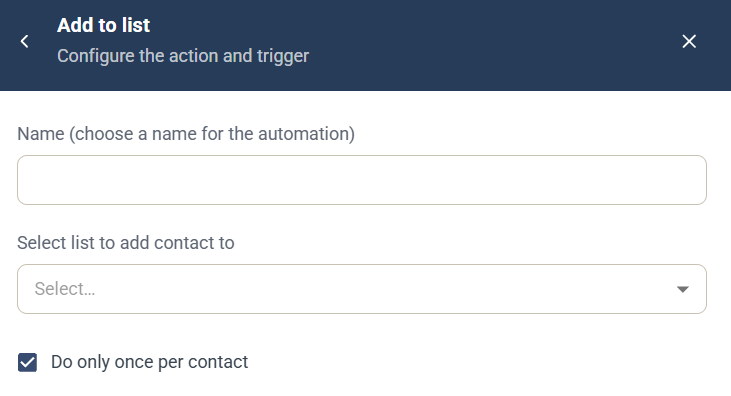

# Add to list-automation

Automatiseringen Add to list är en [kampanjautomatisering](campaign-automations.md) som lägger till den kontakt som utlöste den i en kontaktlista.

## Inställningar

* **Name** — ett namn för automatiseringen, som visas i kampanjens lista **Automation rules**.
* **Select list to add contact to** — välj kontaktlistan.
* **Do only once per contact** — valt som standard, så att automatiseringen körs högst en gång för varje kontakt.

## Utlösare

Välj den komponent och händelse som kör automatiseringen under **When this happens**. Se [Välj utlösare](campaign-automations.md#välj-utlösare).

**Relaterat Journey-steg:** [Contact List](../../documentation/journeys/journey-step-contact-list.md)
