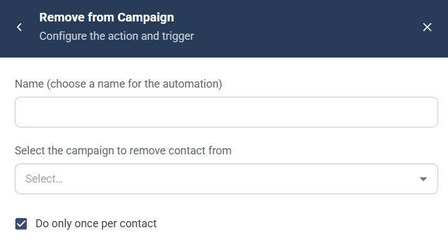

# Remove from Campaign-automation

Automatiseringen Remove from Campaign är en [kampanjautomatisering](campaign-automations.md) som tar bort den kontakt som utlöste den från en kampanj. Själva kontakten tas inte bort.

## Inställningar

* **Name** — ett namn för automatiseringen, som visas i kampanjens lista **Automation rules**.
* **Select the campaign to remove contact from** — välj kampanjen.
* **Do only once per contact** — valt som standard, så att automatiseringen körs högst en gång för varje kontakt.

## Utlösare

Välj den komponent och händelse som kör automatiseringen under **When this happens**. Se [Välj utlösare](campaign-automations.md#välj-utlösare).
