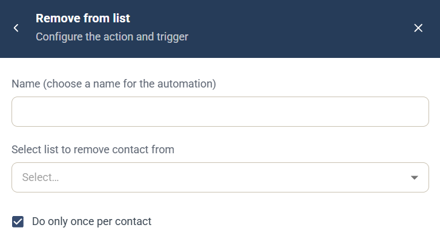

# Remove from list-automation

Automatiseringen Remove from list är en [kampanjautomatisering](campaign-automations.md) som tar bort den kontakt som utlöste den från en kontaktlista. Själva kontakten tas inte bort. Om du vill göra samma sak i en Journey, se steget [Contact List](../../documentation/journeys/journey-step-contact-list.md).

## Inställningar

* **Name** — ett namn för automatiseringen, som visas i kampanjens lista **Automation rules**.
* **Select list to remove contact from** — välj kontaktlistan.
* **Do only once per contact** — valt som standard, så att automatiseringen körs högst en gång för varje kontakt.

## Utlösare

Välj den komponent och händelse som kör automatiseringen under **When this happens**. Se [Välj utlösare](campaign-automations.md#välj-utlösare).
