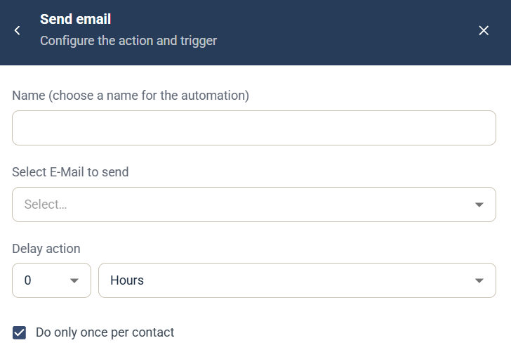

# Send email-automation

Automatiseringen Send email är en [kampanjautomatisering](campaign-automations.md) som skickar ett e-postmeddelande från kampanjen till den kontakt som utlöste den.

## Inställningar

* **Name** — ett namn för automatiseringen, som visas i kampanjens lista **Automation rules**.
* **Select E-Mail to send** — välj det e-postmeddelande som ska skickas.
* **Delay action** — hur länge det ska dröja efter utlösaren innan meddelandet skickas. Ange ett tal och välj en enhet, till exempel timmar.
* **Do only once per contact** — valt som standard, så att automatiseringen körs högst en gång för varje kontakt.

E-postmeddelandet måste redan finnas. Du kan inte skapa ett e-postmeddelande från automatiseringen.

## Utlösare

Välj den komponent och händelse som kör automatiseringen under **When this happens**. Se [Välj utlösare](campaign-automations.md#välj-utlösare).

**Relaterat Journey-steg:** [Send Email](../../documentation/journeys/journey-step-send-email.md)
