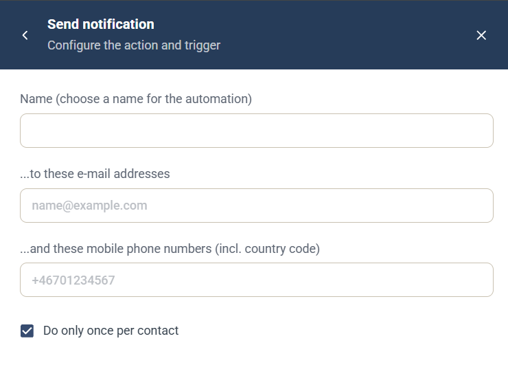

# Send notification-automation

Automatiseringen Send notification är en [kampanjautomatisering](campaign-automations.md) som skickar en avisering om den kontakt som utlöste den, via e-post, SMS eller båda. Använd den för att meddela en kollega, till exempel när en kontakt skickar in ett formulär.

## Inställningar

* **Name** — ett namn för automatiseringen, som visas i kampanjens lista **Automation rules**.
* **...to these e-mail addresses** — de e-postadresser som ska aviseras.
* **...and these mobile phone numbers (incl. country code)** — de mobilnummer som ska aviseras via SMS, inklusive landskod, till exempel +46701234567.
* **Do only once per contact** — valt som standard, så att automatiseringen körs högst en gång för varje kontakt.

## Utlösare

Välj den komponent och händelse som kör automatiseringen under **When this happens**. Se [Välj utlösare](campaign-automations.md#välj-utlösare).

**Relaterat Journey-steg:** [Notify stakeholder](../../documentation/journeys/journey-step-notify-stakeholder.md), som liknar den men bara skickar e-post.
