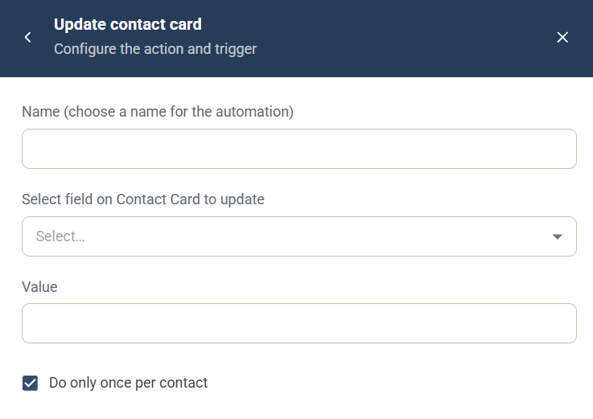

# Update contact card-automation

Automatiseringen Update contact card är en [kampanjautomatisering](campaign-automations.md) som uppdaterar ett fält på kontaktkortet för den kontakt som utlöste den.

## Inställningar

* **Name** — ett namn för automatiseringen, som visas i kampanjens lista **Automation rules**.
* **Select field on Contact Card to update** — välj fältet.
* **Value** — det värde som fältet får.
* **Do only once per contact** — valt som standard, så att automatiseringen körs högst en gång för varje kontakt.

## Utlösare

Välj den komponent och händelse som kör automatiseringen under **When this happens**. Se [Välj utlösare](campaign-automations.md#välj-utlösare).

**Relaterat Journey-steg:** [Update Contact Card](../../documentation/journeys/journey-step-update-contact-card.md)
