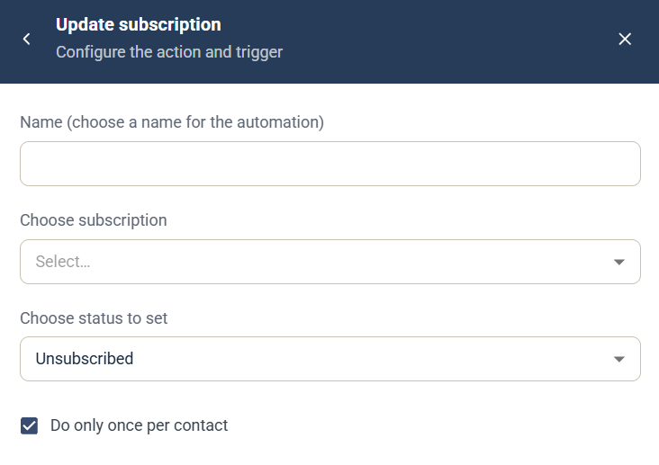

# Update subscription-automation

Automatiseringen Update subscription är en [kampanjautomatisering](campaign-automations.md) som lägger till eller tar bort prenumerationen för den kontakt som utlöste den på en av dina [prenumerationer](../account-admin/subscriptions.md). Om du vill göra samma sak i en Journey, se steget [Update Subscription](../../documentation/journeys/journey-step-update-subscription.md).

## Inställningar

* **Name** — ett namn för automatiseringen, som visas i kampanjens lista **Automation rules**.
* **Choose subscription** — välj prenumerationen.
* **Choose status to set** — den status som kontakten får. Standard är **Unsubscribed**.
* **Do only once per contact** — valt som standard, så att automatiseringen körs högst en gång för varje kontakt.

## Utlösare

Välj den komponent och händelse som kör automatiseringen under **When this happens**. Se [Välj utlösare](campaign-automations.md#välj-utlösare).
