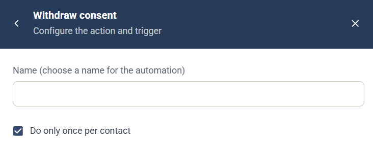

# Withdraw consent-automation

Automatiseringen Withdraw consent är en [kampanjautomatisering](campaign-automations.md) som drar tillbaka samtycket till marknadsföringsutskick för den kontakt som utlöste den.

## Inställningar

* **Name** — ett namn för automatiseringen, som visas i kampanjens lista **Automation rules**.
* **Do only once per contact** — valt som standard, så att automatiseringen körs högst en gång för varje kontakt.

Automatiseringen har inga egna inställningar utöver namnet.

## Utlösare

Välj den komponent och händelse som kör automatiseringen under **When this happens**. Se [Välj utlösare](campaign-automations.md#välj-utlösare).
