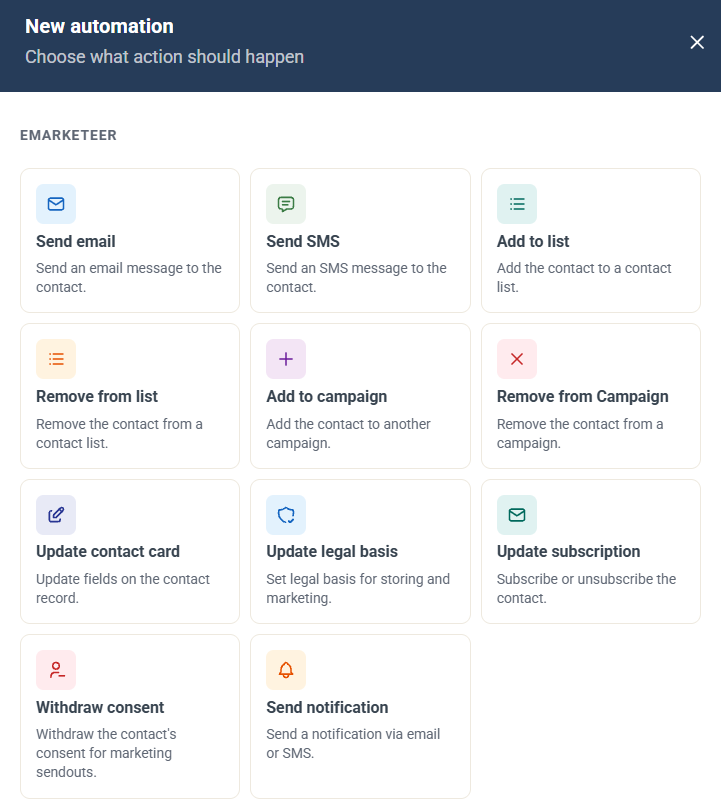
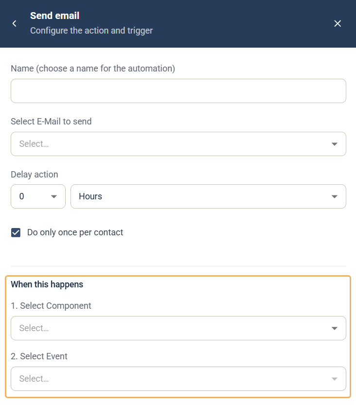

# Kampanjautomatiseringar

Kampanjautomatiseringar är regler i en kampanj. Varje regel utför en åtgärd, till exempel skickar ett e-postmeddelande eller lägger till kontakten i en lista, när en kontakt gör något med någon av kampanjens komponenter.

Använd dem för enkla, direkta uppföljningar av ett utskick eller ett formulär, till exempel ett bekräftelsemejl när ett formulär skickas in, eller en avisering till en kollega när någon klickar på en länk. De är snabba att ställa in, de hör till kampanjen och de följer med när du kopierar kampanjen.

## Hitta en kampanjs automatiseringar

Öppna kampanjen och klicka på fliken **Automation**. Listan **Automation rules** visar varje automatisering med dess utlösare (**When this happens**), dess åtgärd (**Do this**), eventuell fördröjning, om den bara körs en gång per kontakt (**Limitation**) och hur många kontakter den har körts för.

## Skapa en automatisering

1. Öppna kampanjen och klicka på fliken **Automation**.
2. Klicka på **New automation**.
3. Välj den åtgärd som ska utföras.
4. Fyll i inställningarna för åtgärden. Varje automatiserings inställningar beskrivs i en egen artikel nedan.
5. Välj utlösaren under **When this happens**. Se [Välj utlösare](#välj-utlösare).

## Välj utlösare

Varje automatisering har avsnittet **When this happens** längst ned. Där anger du vilken händelse i kampanjen som kör automatiseringen.

1. **Select Component** — välj en av kampanjens komponenter. Bara komponenter i samma kampanj kan utlösa dess automatiseringar.
2. **Select Event** — välj vad kontakten ska göra med komponenten.

Händelserna beror på typen av komponent:

* **E-post** — **Is opened**, **Is sent**, **Any link is clicked** eller **A specific link is clicked**.
* **Formulär** — **Is submitted**.
* **Formulär (Legacy)** — **Is submitted** eller **Specific answer**, som utlöses när ett visst alternativ i en flervalsfråga besvaras.


Öppningar av e-post är en osäker utlösare. Vissa e-postklienter blockerar bilder, och en öppning registreras bara när bilderna laddas. Använd hellre ett klick som utlösare när det går. Se [När registreras en e-post som öppnad?](../reports/email-open.md).


## Inställningar som alla automatiseringar har

* **Name** — ett namn för automatiseringen, som visas i listan **Automation rules**.
* **Do only once per contact** — valt som standard. Automatiseringen körs då högst en gång för varje kontakt, även om kontakten utlöser händelsen igen.
* **Delay action** — finns för automatiseringarna **Send email** och **Send SMS**. Väntar den angivna tiden efter utlösaren innan meddelandet skickas.

## Kopiera eller överföra en kampanj

När du kopierar en kampanj kopieras dess automatiseringar med, så att kopian fungerar på samma sätt. När du [överför en kampanj till ett annat konto](transfer-a-campaign-to-a-different-account.md) följer automatiseringarna inte med.

## Tillgängliga automatiseringar

* **[Send email-automation](campaign-automation-send-email.md)** — skicka ett e-postmeddelande till kontakten.
* **[Send SMS-automation](campaign-automation-send-sms.md)** — skicka ett SMS till kontakten.
* **[Add to list-automation](campaign-automation-add-to-list.md)** — lägg till kontakten i en kontaktlista.
* **[Remove from list-automation](campaign-automation-remove-from-list.md)** — ta bort kontakten från en kontaktlista.
* **[Add to campaign-automation](campaign-automation-add-to-campaign.md)** — lägg till kontakten i en annan kampanj.
* **[Remove from Campaign-automation](campaign-automation-remove-from-campaign.md)** — ta bort kontakten från en kampanj.
* **[Update contact card-automation](campaign-automation-update-contact-card.md)** — uppdatera fält på kontaktkortet.
* **[Update legal basis-automation](campaign-automation-update-legal-basis.md)** — ange rättslig grund för lagring och marknadsföring.
* **[Update subscription-automation](campaign-automation-update-subscription.md)** — prenumerera eller avprenumerera kontakten.
* **[Withdraw consent-automation](campaign-automation-withdraw-consent.md)** — dra tillbaka kontaktens samtycke till marknadsföringsutskick.
* **[Send notification-automation](campaign-automation-send-notification.md)** — skicka en avisering via e-post eller SMS.

Om du har anslutit SuperOffice, se även [SuperOffice-automatiseringar](../integrations/superoffice-automations-pro.md).

## Kampanjautomatiseringar och Journeys

Kampanjautomatiseringar och [Journeys](../journeys/journeys.md) kan utföra många av samma åtgärder. Välj det som passar uppgiften:

* Använd en **kampanjautomatisering** när en åtgärd ska utföras direkt efter en händelse i den här kampanjen, till exempel när ett formulär skickas in eller någon klickar på en länk.
* Använd en **Journey** när du behöver flera steg, väntesteg, If / Else-förgreningar eller villkor, eller en utlösare utanför kampanjen. Se [Journey-steg](../../documentation/journeys/journey-steps.md).

Många automatiseringar har ett Journey-steg som gör samma sak:

| Kampanjautomatisering | Närmaste Journey-steg |
|---|---|
| Send email | [Send Email](../../documentation/journeys/journey-step-send-email.md) |
| Send SMS | [Send SMS / Text message](../../documentation/journeys/journey-step-send-sms.md) |
| Add to list | [Contact List](../../documentation/journeys/journey-step-contact-list.md) |
| Remove from list | [Contact List](../../documentation/journeys/journey-step-contact-list.md) |
| Add to campaign | — |
| Remove from Campaign | — |
| Update contact card | [Update Contact Card](../../documentation/journeys/journey-step-update-contact-card.md) |
| Update legal basis | [Legal Basis](../../documentation/journeys/journey-step-legal-basis.md) |
| Update subscription | [Update Subscription](../../documentation/journeys/journey-step-update-subscription.md) |
| Withdraw consent | — |
| Send notification | [Notify stakeholder](../../documentation/journeys/journey-step-notify-stakeholder.md) |
