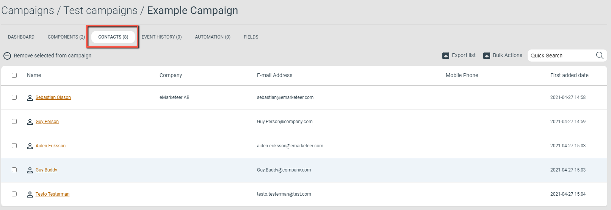

# Kampanjkontakter

Kampanjkontakter är en flik i varje kampanj som listar de kontakter som tillhör den kampanjen.

Använd den för att se vilka som har interagerat med kampanjen, granska enskilda kontakters historik och ta bort oönskade kontakter.

En kontakt läggs till i listan Kampanjkontakter när den:

* Är mottagare av ett utskickat e-post som tillhör kampanjen. Kontakter som exkluderas före utskick läggs inte till.
* Är mottagare av ett utskickat SMS som tillhör kampanjen. Kontakter som exkluderas före utskick läggs inte till.
* Skickar in ett formulär som tillhör kampanjen.
* Besöker en webbsida som tillhör kampanjen. Anonyma besök läggs inte till.
* Importeras till kampanjen via funktionen Import Contacts i kampanjens vänstermeny.

## Gränssnittet för Kampanjkontakter

Gränssnittet för Kampanjkontakter

Klicka på en enskild kontakt för att se historiken över deras interaktioner i kampanjen. Använd Quick Search uppe till höger i fliken för att hitta en specifik kontakt.

### Ta bort kontakter från en kampanj

Du kan använda fliken för att ta bort oönskade kontakter från kampanjen, och därmed från varje komponentrapport i kampanjen. Det är användbart för att ta bort testkontakter.

1. Markera kontakterna som ska tas bort med kryssrutorna till vänster på varje rad.
2. Klicka på Remove selected from campaign ovanför listan.

## Alla kontakter i denna kampanj (mottagarkälla)

Du kan rikta utskick till Kampanjkontakter med alternativet "All contacts in this campaign" när du skickar ett e-post eller SMS. Se definitionen högst upp i artikeln för vad som räknas som en kampanjkontakt.

Alternativet "All contacts in this campaign"
