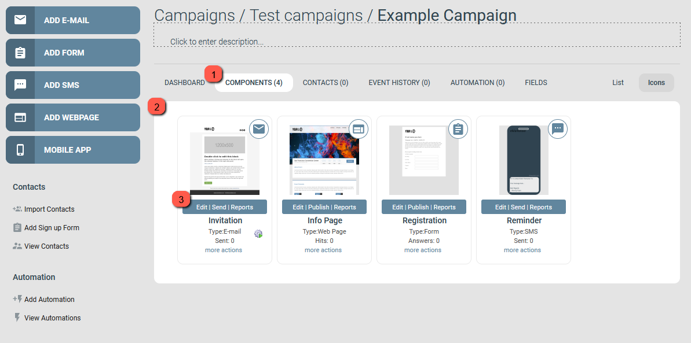

# Kampanjgränssnittet förklarat

Den här artikeln beskriver kampanjgränssnittet, med fokus på vyn Components.

Vänstra sidan av skärmen innehåller menyn Add components och snabblänkar för kontakthantering och automationer. Högra sidan visar kampanjens olika vyer.

Komponenter utgör innehållet i din kampanj. Det finns fyra komponenttyper: [Emails](https://support.emarketeer.com/knowledgebase/basics-creating-email/), [Forms](https://support.emarketeer.com/knowledgebase/basics-creating-form/), [SMS](https://support.emarketeer.com/knowledgebase/basics-creating-sms/) och [Webpages](https://support.emarketeer.com/knowledgebase/creating-first-webpage/), plus en underkomponent, Mobile apps.

Kampanjens användargränssnitt

## 1. Kampanjvyer

Under kampanjens sökväg, namn och beskrivning ligger flera flikar. Varje flik är en separat vy av kampanjen:

- Dashboard
  Bygg kampanjspecifika rapporter med rapportwidgets. Se [campaign reports](https://support.emarketeer.com/knowledgebase/how-to-use-emarketeer-campaign-reports/).
- Components
  Standardvyn. Organisera och visa kampanjens komponenter. Siffran inom parentes visar hur många komponenter kampanjen har.
- Contacts
  Listar kontakter som lagts till i kampanjen, antingen importerade direkt eller automatiskt tillagda genom interaktion. Siffran inom parentes visar hur många kontakter som för närvarande är kopplade till kampanjen. [Läs mer](https://support.emarketeer.com/knowledgebase/campaign-contacts/).
- Event history
  Visar händelser för utskickade e-post eller SMS. Granska när en komponent skickades, samt granska eller avbryt kommande schemalagda utskick. Siffran inom parentes visar schemalagda utskick som väntar i kampanjen.
- Automation
  Lägg till automatiserade åtgärder i kampanjen. Automationer triggas av att en kontakt interagerar med en komponent, så kampanjen måste innehålla minst en komponent. Siffran inom parentes visar hur många automationer som finns i kampanjen.
- Fields
  Definiera fält som är unika för kampanjen och som kan flätas in i komponentinnehåll som variabler. Att redigera ett fältvärde ersätter variabeln i varje komponent som använder det. [Läs mer om kampanjfält](https://support.emarketeer.com/knowledgebase/how-to-use-campaign-fields-in-emarketeer/).

## 2. Vyspecifikt område

Området med vit bakgrund visar gränssnittet för den aktiva vyn. Skärmbilden ovan visar vyn Components.

## 3. Vyn Components

I vyn Components visas komponenter antingen som miniatyrer eller som en lista. Växla mellan dem med List eller Icons uppe till höger. Den här guiden använder standardinställningen Icons.

Miniatyrer visas inte i någon särskild ordning, men du kan ordna om dem med drag och släpp. Dubbelklicka på en miniatyr för att öppna komponenteditorn.

Under varje miniatyr finns en meny med Edit, Send/Publish och Reports. Det här är komponentens huvudsektioner:

- Edit
  Öppnar komponenteditorn där du ändrar komponentens innehåll.
- Send
  Öppnar sidan Send options. Skicka eller schemalägg en komponent. Tillgängligt endast för e-post och SMS.
- Publish
  Öppnar sidan Publish options. Visar komponentens direkt-URL och andra publiceringsalternativ. Tillgängligt endast för formulär och webbsidor.
- Reports
  Öppnar komponentrapporten. Varje komponenttyp har sin egen rapport med olika mätvärden.

Under komponentens huvudmeny finns ett område med extra information om komponenten, till exempel typ och användningsstatistik. Under det finns menyn More actions.

### Menyn More actions

Den här menyn ger alternativ för att hantera komponenten:

- Delete
  Tar bort komponenten från kampanjen. När en komponent tas bort försvinner dess rapport och kopplad statistik. Kontaktinteraktioner med komponenten tas bort från kontaktens Engagement-tidslinje.
- Rename
  Byter namn på komponenten. Namnet är endast synligt för eMarketeer-användare, inte för kontakter.
- Copy
  Skapar en kopia i kampanjen med namnet "Copy of [komponentnamn]". Kopian har en ren rapport men är i övrigt identisk med originalet.
- Move
  Flyttar komponenten till en annan kampanj. Interna länkar till komponenter i ursprungskampanjen kan sluta fungera i den nya kampanjen.
- Make template
  Skapar en kopia av komponenten som en mall, tillgänglig i menyn Add components under My templates. My templates listar alla sparade mallar på ditt konto.
