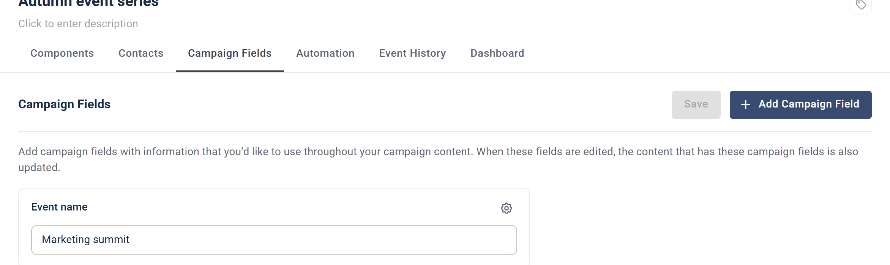
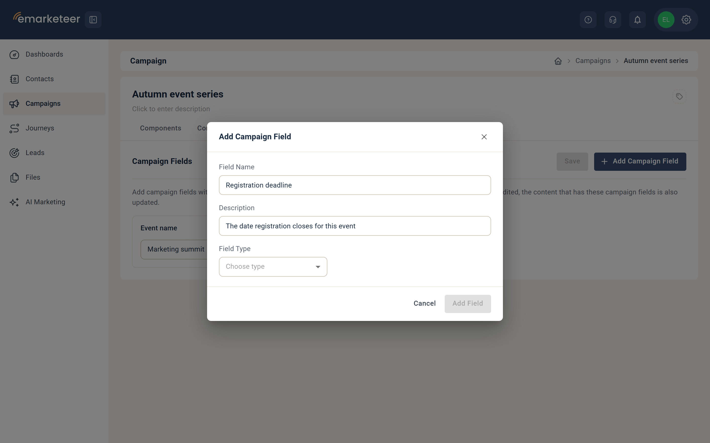
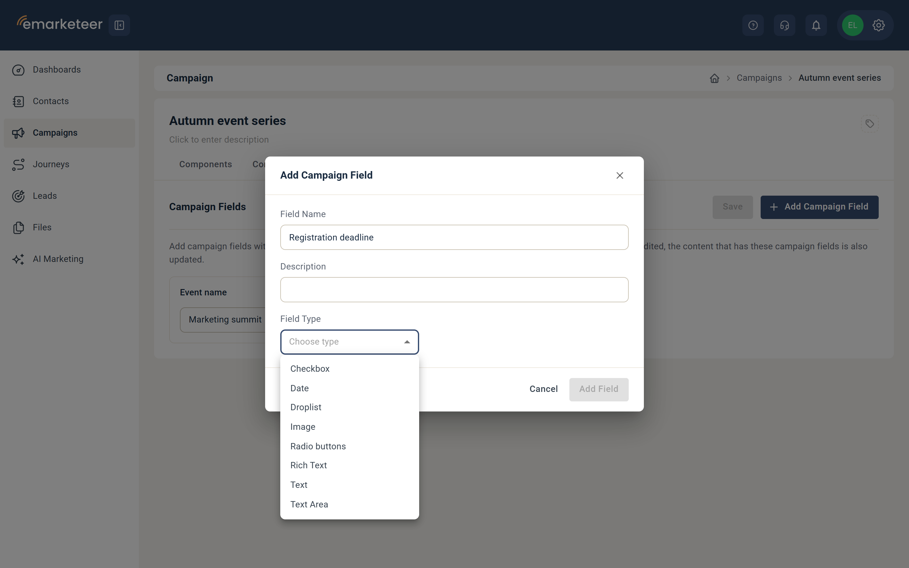
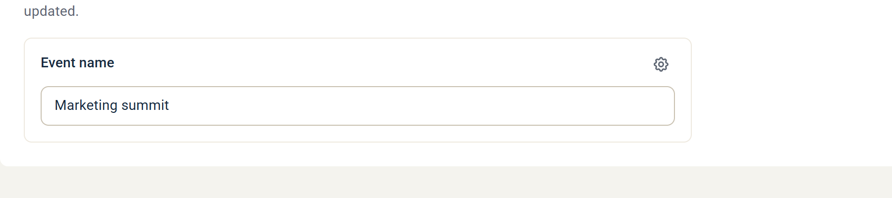
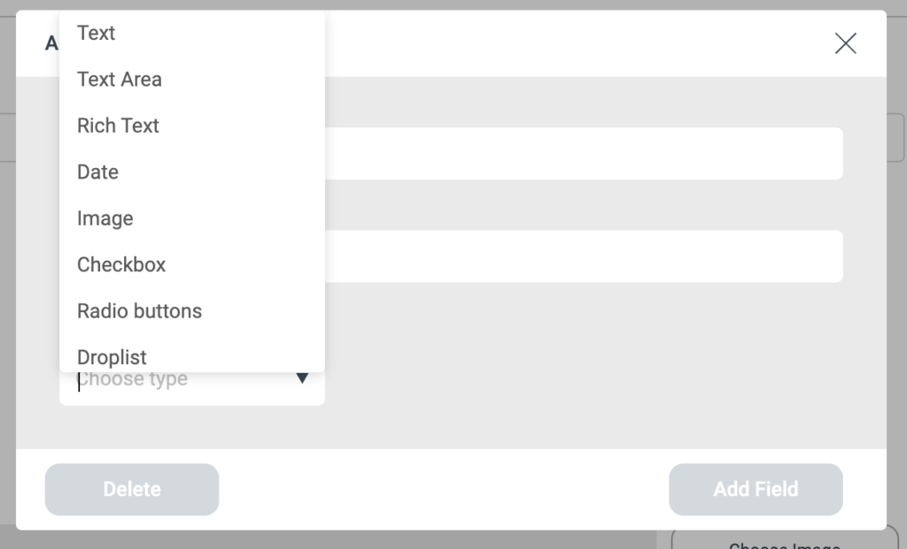
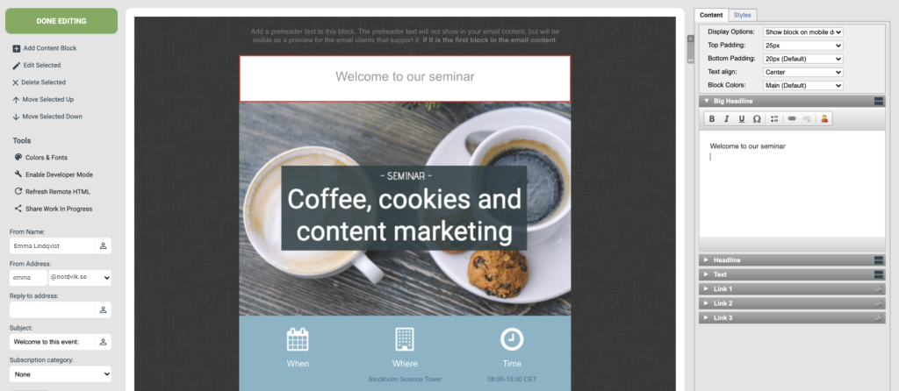
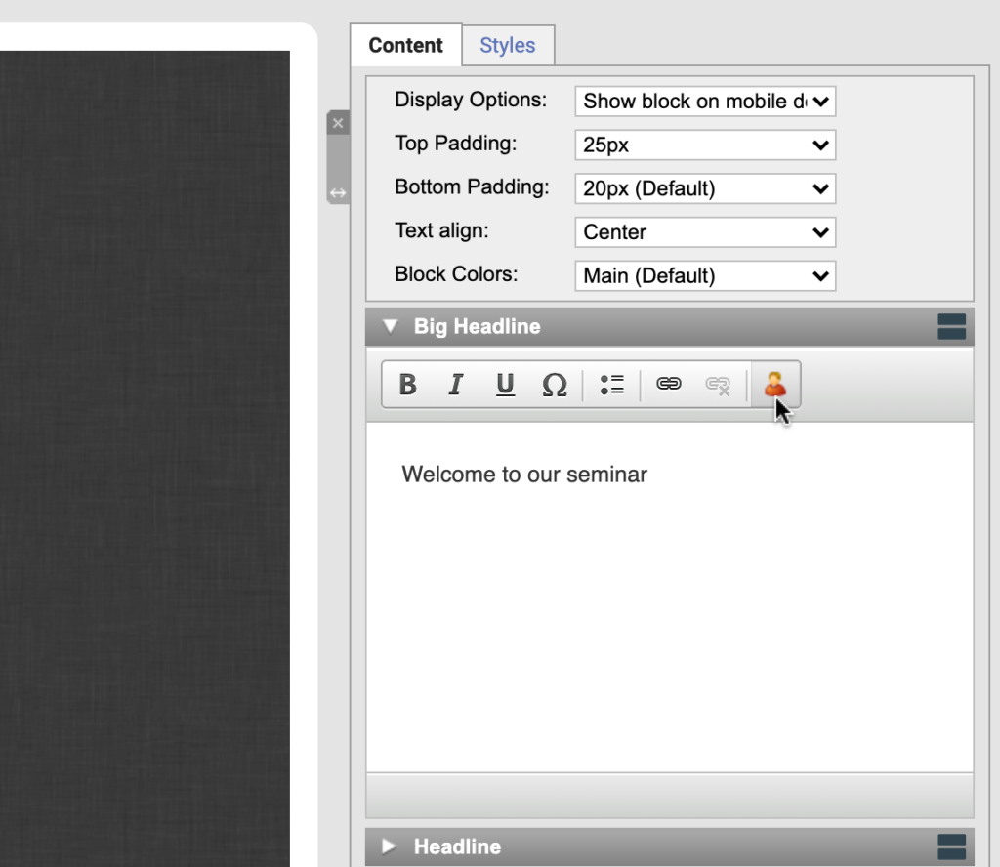
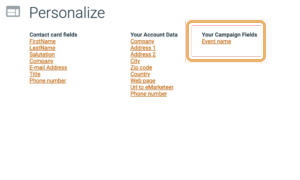
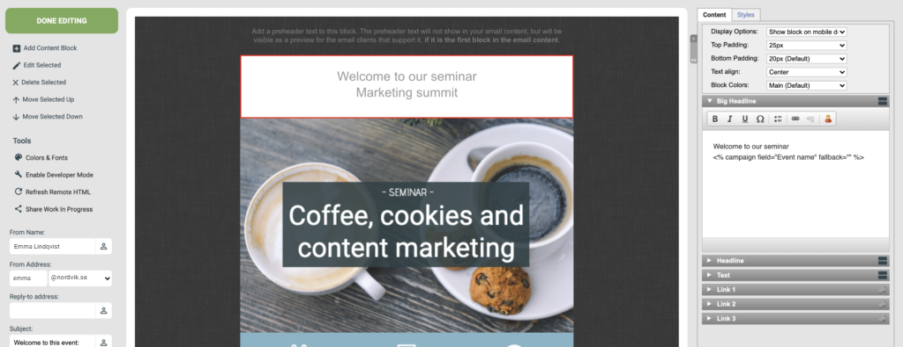
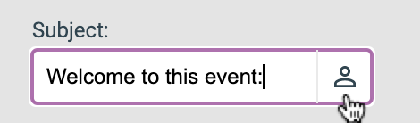

# Så använder du kampanjfält i eMarketeer

Med kampanjfält kan du lagra anpassad information en gång och återanvända den i allt kampanjinnehåll.

I den här artikeln lär du dig varför kampanjfält är användbara, hur du sätter upp dem, hur du infogar dem i ditt innehåll och några extra tips.

## Vad är kampanjfält?

Ett kampanjfält innehåller anpassad information som du vill återanvända i en kampanj — titlar, evenemangsnamn, beskrivningar, bilder, datum och så vidare. Det är upp till dig vilka fält du lägger till.

## Varför använda kampanjfält?

Istället för att skriva in samma information i varje innehållsdel sparar du den en gång som ett kampanjfält och refererar till det. När informationen ändras uppdaterar du fältet och varje komponent som använder det uppdateras automatiskt. Det är särskilt användbart när du kopierar en kampanj — du redigerar bara fälten för att uppdatera hela kampanjen.

## Så sätter du upp kampanjfält



### Öppna fliken Fields

Gå till fliken **Campaign Fields** i din kampanj och klicka på **Add Campaign Field**.




### Namnge fältet

Namnge fältet i dialogrutan. Låt namnet tydligt beskriva vad fältet innehåller — till exempel "event name." Använd beskrivningen för att notera hur och när du använder fältet som en referens för framtida redigeringar.




### Välj fälttyp

Tillgängliga typer är:

* **Text:** lämpligt för rubriker eller namn.
* **Text area:** som text men med mer plats — lämpligt för beskrivningar eller sammanfattningar. Stöder HTML.
* **Date:** med valfri tid.
* **Image:** lägg till en bild från ditt eMarketeer-bildbibliotek eller klistra in en bildlänk. Se till att länken börjar med https.
* **Rich text:** för text som du vill formatera med fetstil, kursiv, hyperlänkar och så vidare.
* **Checkbox:** visa eller dölj en del av innehållet beroende på om rutan är ikryssad. Två evenemang delar exempelvis en kampanj, men bara ett behöver inkludera parkeringsinformation — en kryssruta styr om parkeringstexten visas.
* **Radio buttons:** välj ett av flera alternativ. För evenemang på olika platser kan du lägga till radioknappar för varje plats och det valda värdet flödar in i innehållet.
* **Droplist:** välj ett eller flera alternativ från en lista. Till exempel en lista med talare — välj de som är med på det här evenemanget och de visas i ditt innehåll.




### Ange fältvärdet

När du har valt typ visas ett värdefält. Fyll i värdet.

Upprepa för varje kampanjfält du behöver. Klicka på save. Använd kugghjulet för att redigera eller ta bort ett fält.




## Så lägger du till ett kampanjfält i ditt innehåll

Att lägga till ett kampanjfält fungerar på samma sätt som att infoga en kontakts förnamn.



### Öppna textblockredigeraren

Klicka på textblocket där du vill lägga till fältet i din innehållseditor — ett e-post i det här exemplet.




### Klicka på personaliseringsikonen




### Välj och infoga kampanjfältet

I dialogrutan ser du fälten på kontaktkortet tillsammans med kampanjfälten du satt upp. Det är därför tydliga namn spelar roll.

Välj kampanjfältet och klicka på save. Fältet läggs till i ditt innehåll.




## Så lägger du till ett kampanjfält som bild eller i ett formulär

För närvarande finns ingen personaliseringsknapp för bildblock eller formuläreditorn. För att använda ett kampanjfält där, gå till ett textblock, kopiera kampanjfältets länk och klistra in den i ditt formulär eller som bild-URL i ditt bildblock.

## Använd kampanjfält i din avsändarinformation

Du kan också använda ett kampanjfält i ämnesraden. Klicka på personaliseringsikonen bredvid ämnet och välj kampanjfältet.

