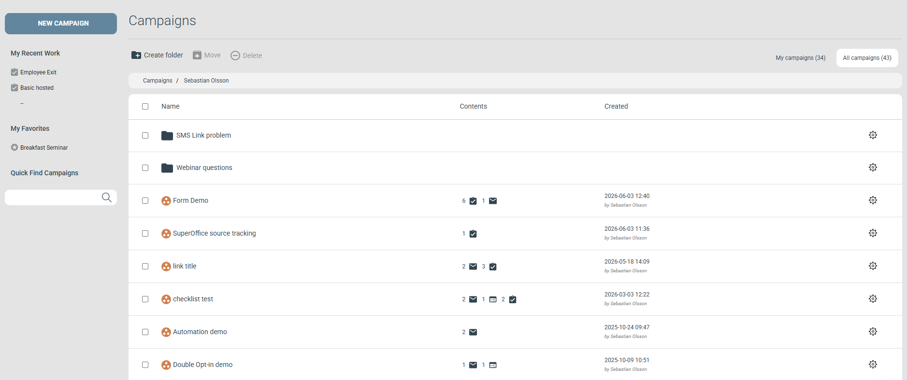

# Organisera kampanjer

En kampanj fungerar som ett projekt som grupperar relaterade komponenter — till exempel alla e-postmeddelanden, formulär och webbsidor som hör till ett visst event eller nyhetsbrev. När ditt konto fylls med kampanjer gör lite struktur dem lättare att hitta. Se [Så här skapar du en ny kampanj](../getting-started/create-new-campaign.md) för att skapa din första.

## Listvyn Campaigns

Campaigns-listan ger dig en överblick över alla kampanjer utan att du behöver öppna någon av dem. Kolumnen Contents visar hur många komponenter av varje typ en kampanj innehåller, så att du ser innehållet med en blick. Du ser också vem som skapade varje kampanj och när. Kampanjerna sorteras med den senast skapade först.

## Organisera kampanjer i mappar

Gruppera kampanjer i mappar efter typ — till exempel Nyhetsbrev, Event, Enkäter, Webbformulär, Internt eller Kampanjerbjudanden. Att sortera efter syfte gör varje enskild kampanj snabbare att hitta senare.

### Skapa en mapp

För att skapa en mapp klickar du på **Create folder** i den övre verktygsraden i Campaigns-listan. En mapp kan innehålla andra mappar eller kampanjer. En kampanj kan inte innehålla mappar.

### Flytta kampanjer och mappar

Det finns två sätt att flytta saker:

* **Dra och släpp** — klicka på ikonen, dra den och släpp den på en annan mapp. För att flytta ut ett objekt ur dess nuvarande mapp släpper du det var som helst på brödsmulespåret.
* **Knappen Move** — bocka i rutan till vänster om en kampanjs eller mapps namn och klicka sedan på **Move** i den övre verktygsraden. Det är det bättre valet när du vill flytta flera kampanjer eller mappar samtidigt.

## Alternativ per kampanj

Varje kampanj har ytterligare alternativ bakom kugghjulsikonen längst till höger på sin rad:

* **Add favorite** — Lägger till kampanjen som favorit, snabbt åtkomlig från sektionen My favorites i menyn till vänster.
* **Rename** — Ger kampanjen ett nytt namn.
* **Copy** — Skapar en kopia av kampanjen i samma mapp. Eftersom den är den senast skapade kampanjen sorteras kopian först.
* **Transfer** — Skapar en kopia av kampanjen i ett annat eMarketeer-konto. Se [Överför en kampanj till ett annat konto](transfer-a-campaign-to-a-different-account.md).
