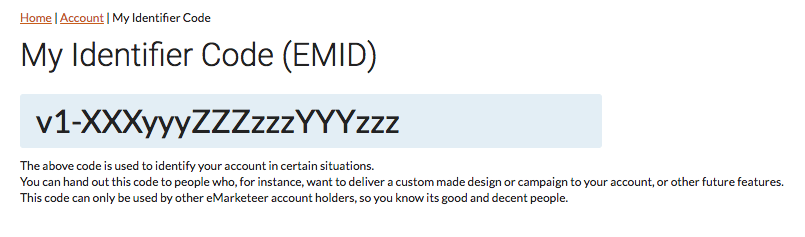
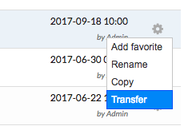
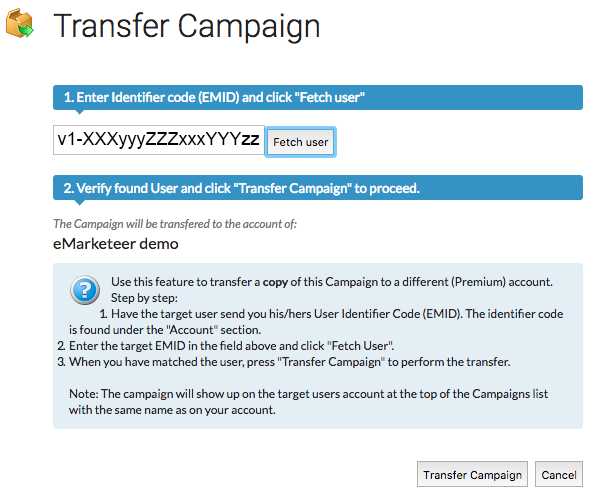

---
description: >-
  Hur du kopierar en kampanjs komponenter från ett eMarketeer-konto till ett annat, med originalkampanjen kvar på plats.
---

# Överför en kampanj till ett annat konto

Du kan överföra en kopia av en kampanj från ett eMarketeer-konto till ett annat. Det är användbart när din organisation driver flera separata konton och vill dela arbete mellan dem.

Endast kampanjens komponenter överförs. Kontakter och automationer stannar kvar i ursprungskontot, och ursprungskampanjen ligger kvar — destinationen får en kopia.

### Innan du börjar

Du behöver två saker:

1. En kampanj du vill överföra.
2. EMID för destinationskontot.

### Hämta EMID för destinationen

EMID är en unik identifierare för ett eMarketeer-konto. Be en användare på destinationskontot att logga in och klicka på "Account" → "My Identifier Code (EMID)".

Be dem kopiera koden och skicka den till dig.

### Överför kampanjen

Öppna "Campaigns" och leta upp kampanjen du vill överföra i listan. Klicka på kugghjulsikonen längst till höger på den raden, och klicka sedan på "Transfer".

En dialogruta öppnas och frågar efter EMID för destinationskontot. Klistra in EMID:n du fick och klicka på "Fetch User".

Verifiera att destinationskontot ser rätt ut, klicka sedan på "Transfer Campaign" för att slutföra överföringen.

### Efter överföringen

Det mottagande kontot har nu en kopia av kampanjen som första post i sin kampanjlista.
