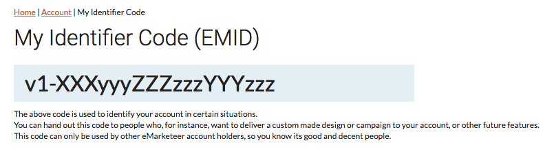

# Överför en kampanj till ett annat konto

Du kan överföra en kopia av en kampanj från ett eMarketeer-konto till ett annat. Det är användbart när din organisation driver flera separata konton och vill dela arbete mellan dem.

Endast kampanjens komponenter överförs. Kontakter och automationer stannar kvar i ursprungskontot, och ursprungskampanjen ligger kvar — destinationen får en kopia.

### Innan du börjar

Du behöver två saker:

1. En kampanj du vill överföra.
2. TenantID för destinationskontot.

### Hämta TenantID för destinationen

TenantID är en unik identifierare för ett eMarketeer-konto. Be en användare på destinationskontot att logga in och klicka på sin avatar uppe till höger. Deras TenantID visas överst i menyn, under e-postadressen och företagsnamnet.

Be dem kopiera koden och skicka den till dig.

### Överför kampanjen

Öppna "Campaigns" och leta upp kampanjen du vill överföra i listan. Klicka på ikonen med tre punkter längst till höger på den raden, och klicka sedan på "Transfer campaign".

En dialogruta öppnas och frågar efter TenantID för destinationskontot. Klistra in det TenantID du fick och klicka på "Fetch User".

Verifiera att destinationskontot ser rätt ut, klicka sedan på "Transfer Campaign" för att slutföra överföringen.

### Efter överföringen

Det mottagande kontot har nu en kopia av kampanjen som första post i sin kampanjlista.
