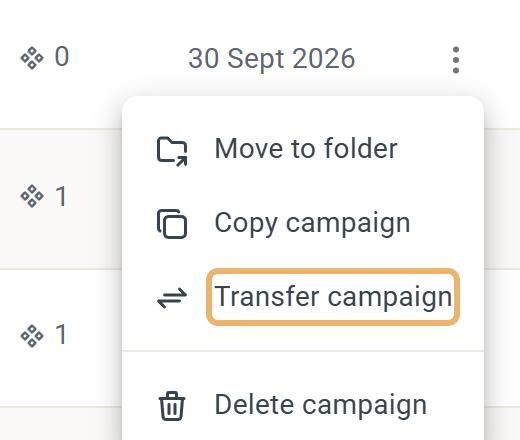
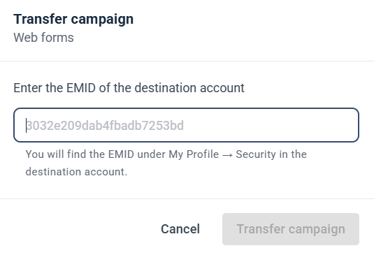

# Överför en kampanj till ett annat konto

Du kan överföra en kopia av en kampanj från ett eMarketeer-konto till ett annat. Det är användbart när din organisation driver flera separata konton och vill dela arbete mellan dem.

Endast kampanjens komponenter överförs. Kontakter och automationer stannar kvar i ursprungskontot, och ursprungskampanjen ligger kvar — destinationen får en kopia.

### Innan du börjar

Du behöver två saker:

1. En kampanj du vill överföra.
2. EMID för en användare på destinationskontot.

### Hämta EMID för destinationskontot

EMID (My Identifier Code) är en kod som är unik för en användare på ett specifikt eMarketeer-konto. Be en användare på destinationskontot att logga in, klicka på kugghjulsikonen uppe till höger och gå till **My Profile** > **Security**. Koden finns under **My Identifier Code (EMID)**.

Be dem klicka på kopieringsikonen bredvid koden och skicka koden till dig.

### Överför kampanjen

Öppna "Campaigns" och leta upp kampanjen du vill överföra i listan. Klicka på ikonen med tre punkter längst till höger på den raden, och klicka sedan på "Transfer campaign".

En dialogruta öppnas och frågar efter EMID för destinationskontot. Klistra in det EMID du fick och klicka på **Transfer campaign**.

### Efter överföringen

Det mottagande kontot har nu en kopia av kampanjen som första post i sin kampanjlista.
