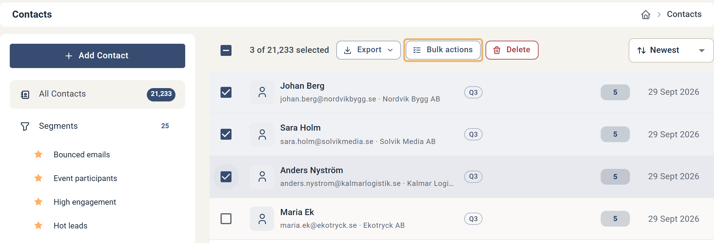

# Så här hanterar du kontakter i bulk

Bulk Actions (Massåtgärder) låter dig uppdatera eller hantera grupper av kontakter i en enda operation.

Gå till **Contacts** och markera de kontakter du vill ändra med kryssrutorna i listan. Om du vill markera alla kontakter i den aktuella vyn använder du kryssrutan högst upp i listan. Knappen **Bulk actions** visas då överst i listan, bredvid **Export**. Använd den när du behöver tillämpa samma ändring på många kontakter samtidigt.

## Alternativ för Bulk Actions

Bulk Actions-verktyget erbjuder sju funktioner:

1. **Contact lists** — Lägger till kontakterna i, eller tar bort dem från, en kontaktlista. Välj **Add to list** eller **Remove from list** och välj sedan en lista. Du kan skapa en ny kontaktlista om det inte redan finns en.
2. **Tags** — Lägger till taggar på, eller tar bort taggar från, alla kontakter. Välj **Apply tag** eller **Remove tag** och välj eller skapa sedan en tagg.
3. **Update category** — Uppdaterar Contact Category (Prospect, Customer, Other) för alla kontakter.
4. **Update subscriptions** — Ändrar opt-in/opt-out-status för prenumerationslistor för kontakterna. Du kan uppdatera vilken som helst eller alla prenumerationslistor i en operation.
5. **Update legal basis** — Uppdaterar Legal Basis för alla kontakter. Du kan uppdatera både "Store and Process" och "Marketing Sendouts" samtidigt, och till olika alternativ om det behövs.
6. **Unsubscribe** — Avregistrerar kontakterna från alla framtida e-post- och SMS-utskick genom att sätta deras Legal Basis för Marketing Sendouts till "Withdrawn."
7. **Permanently delete contacts** — Tar bort kontakterna permanent från ditt konto tillsammans med alla interaktioner de varit en del av. Borttagna kontakter kan inte återställas. Det inkluderar deras interaktioner, aktivitet och engagemangshistorik.
