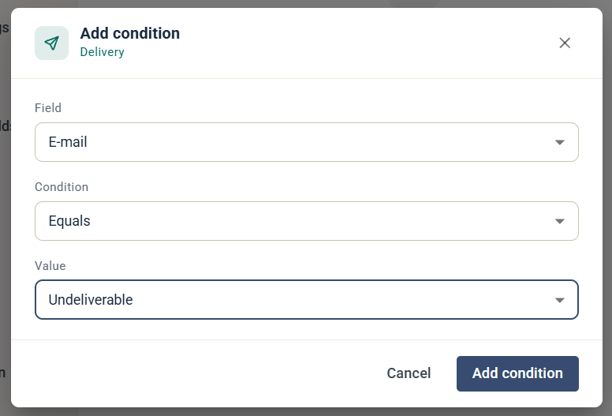
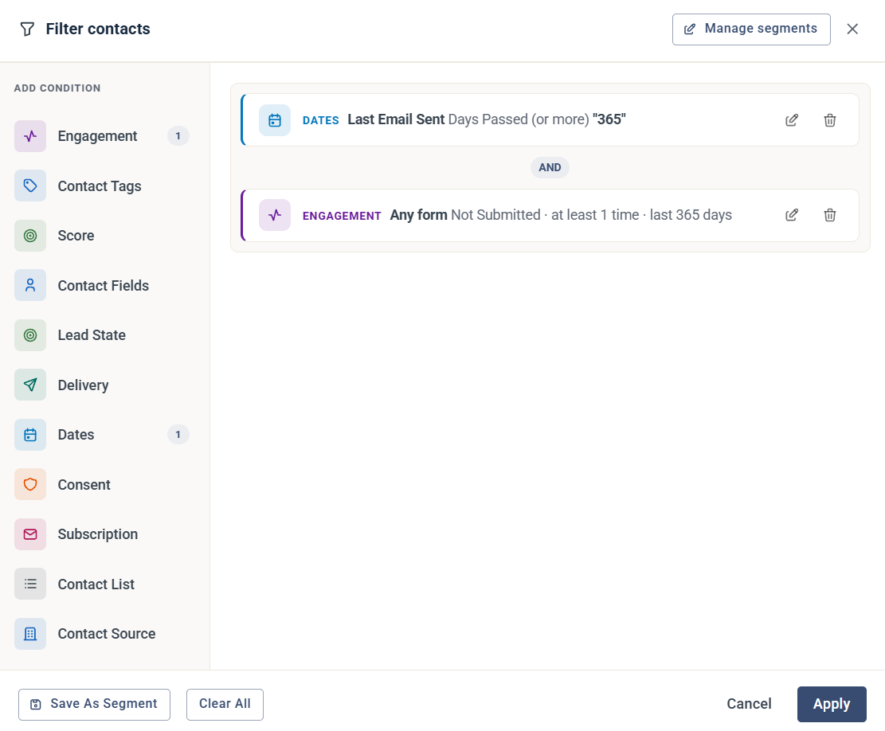

# Så här rensar du dina kontakter

Den här guiden visar hur du hittar kontakter som inte längre är relevanta för ditt konto, så att du kan ta bort dem.

Att rensa regelbundet håller dina rapporter korrekta, håller antalet kontakter inom din plan och skyddar ditt avsändarrykte, eftersom du bara skickar till personer som vill ha dina e-postmeddelanden.

## Hitta kontakter med filterverktyget

Alla exempel nedan använder filterverktyget. Klicka på **Contacts** i vänstermenyn och klicka sedan på **Filter** ovanför kontaktlistan. Hur filterverktyget fungerar beskrivs i [Så bygger och använder du kontaktfilter](how-to-build-contact-filters.md).

Klicka på **Save As Segment** för att spara ett filter som du vill köra igen, så att rensningen blir en rutin.

## Olevererbara kontakter

Olevererbara kontakter är kontakter där leveransen av e-post har misslyckats. Lägg till ett **Delivery**-villkor med **E-mail** **Equals** **Undeliverable** för att hitta dem.

De är säkra att ta bort, eftersom eMarketeer redan utesluter dem från utskick. Se [Hantering av e-poststudsar](../email-deliverability/bounce-handling.md).

eMarketeer kommer ihåg att en adress är olevererbar. Om du tar bort kontakten och lägger till den igen är den fortfarande markerad som olevererbar.


Några olevererbara kontakter kan vara felaktigt markerade. I stället för att behålla alla, gör det till en rutin att kontrollera studsarna efter varje utskick för att hitta något oväntat.


## Kontakter som dragit tillbaka sitt samtycke

De här kontakterna har valt bort e-post med marknadsföring. Lägg till två **Consent**-villkor för att hitta dem: **Legal Basis** är **Withdrawn** och **Purpose** är **Marketing sendouts**.

De utesluts automatiskt från utskick och är säkra att ta bort. eMarketeer behåller deras samtyckeshistorik, så om du importerar dem igen vet eMarketeer fortfarande att de dragit tillbaka sitt samtycke och skickar inte marknadsföring till dem.

## Kontakter du inte använt på ett år

Varje kontakt har ett **Last Email Sent**-datum, som sätts varje gång ett e-postmeddelande skickas till kontakten. Använd det för att hitta kontakter du inte har skickat e-post till på ett helt år:

1. Lägg till ett **Dates**-villkor: **Last Email Sent**, **Days Passed (or more)**, **365**.
2. Lägg till ett **Engagement**-villkor: **Any form**, **Not Submitted**, minst 1 gång, de senaste 365 dagarna. Då behålls kontakter som har skickat in ett formulär under året.

Resultatet är kontakter som finns i eMarketeer men som du inte har skickat e-post till, och som inte har skickat in några formulär, på ett år. Om du har bra regler för [lead scoring](../lead-board-scoring/how-lead-scoring-works-in-emarketeer.md) kan du använda ett **Score**-villkor på samma sätt.

## Levererbara men oengagerade kontakter

De här kontakterna kan ta emot dina e-postmeddelanden, men de öppnar dem inte och klickar inte på några länkar. Lägg till ett **Delivery**-villkor med **E-mail** **Equals** **Deliverable but unengaged** för att hitta dem.

De kan vara värda att ta bort, men överväg att först ge dem en chans med en [Journey](../journeys/journeys.md) för återaktivering. Se även [Exkludera inaktiva mottagare](../../documentation/email-sms/exclude-inactive-recipients.md).

## Ta bort kontakterna

När filtret visar de kontakter du vill ta bort markerar du dem och väljer **Bulk actions** › **Permanently delete contacts**. Se [Så här hanterar du kontakter i bulk](bulk-actions-tool.md).


Borttagna kontakter kan inte återställas inifrån eMarketeer. Om du kan behöva deras uppgifter senare klickar du på **Export** och sparar en kopia innan du tar bort dem.

