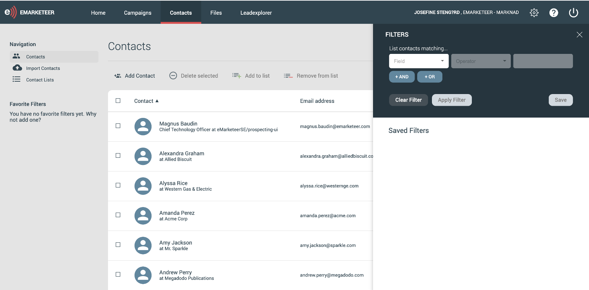
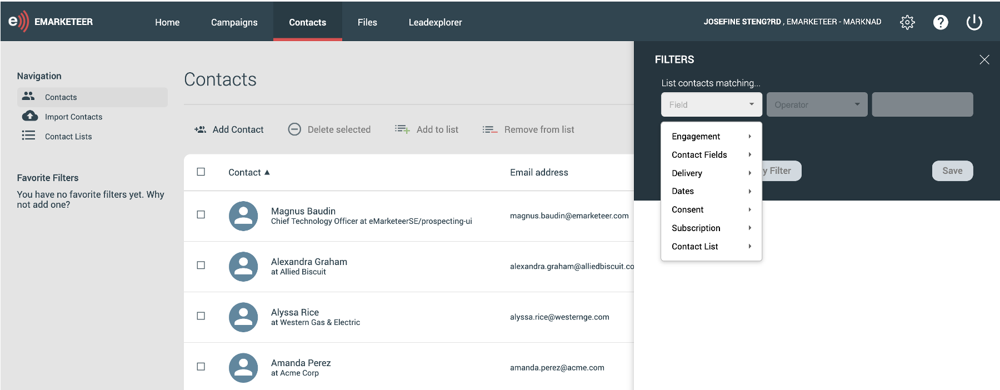
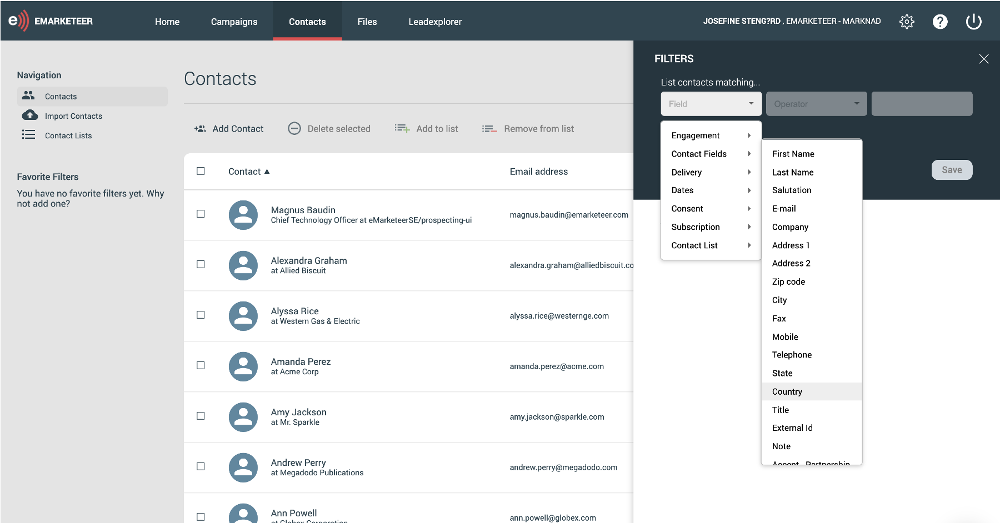

# Så bygger och använder du kontaktfilter

Filter låter dig segmentera kontakter efter vilka kriterier du än ställer in, från breda grupper till mycket specifika urval.

Den här artikeln går igenom filterbyggaren, visar några exempelfilter och täcker de åtgärder du kan utföra på ett urval av kontakter.

## Lär känna filterbyggaren

I eMarketeer, klicka på fliken "contacts". Det är här du arbetar med och lär känna dina kontakter. För att segmentera eller bygga ett urval, klicka på fliken "filter" till höger, precis ovanför kontaktlistan. En webbpanel öppnas — det är här du bygger filter och hittar dem du har sparat.

Den första rullgardinsmenyn listar varje kategori du kan filtrera på:

* Contact fields (all information på kontaktkortet)
* Marketing engagement
* Delivery
* Dates
* Consent
* Subscription categories
* Contact lists

## Bygg ett filter

För att bygga ett filter, välj kategori och sedan en lämplig operator — till exempel "equals" eller "doesn't equal". Vilka operatorer som är tillgängliga beror på kategorin.

För ett enkelt exempel, segmentera kontakter efter land:

1. I första rullgardinsmenyn, välj Contact fields -> country.

2. I operator-rullgardinen, välj "equals".

3. I det tredje fältet, skriv landet.

4. Klicka på "apply". Du ser nu alla kontakter som matchar filtret.

## Gör ett filter mer specifikt genom att lägga till kriterier

För att avgränsa ett filter, lägg till fler kriterier. Efter det första, klicka på "and" eller "or" för att lägga till ett till.

* AND: kontakten måste matcha båda kriterierna.

* OR: kontakten måste matcha ett av kriterierna.

Du kan lägga till så många kriterier du vill och blanda AND och OR i samma filter.

## Filtrera på engagemang

Engagemangskategorin är värd att lyfta fram. Du kan filtrera kontakter efter hur de engagerade sig i din marknadsföring — till exempel om de fyllde i ett specifikt formulär, klickade på en länk i en e-post eller besökte en sida på din webbplats. Detta är användbart för att gruppera kontakter som har visat tillräckligt intresse för att skickas vidare till sälj, eller för att skicka uppföljande innehåll baserat på aktivitet.

## Spara filter

Spara ett filter för att snabbt komma tillbaka till det. Sparade filter är inte personliga — varje användare på ditt konto kan se dem. Du hittar sparade filter i samma panel som filterbyggaren. Du kan också markera ett filter som favorit för att fästa det i menyn till vänster.

## Vad du kan göra med ditt urval av kontakter

### Bulk actions

Flera massåtgärder låter dig uppdatera varje kontakt i filtret samtidigt. Du kan uppdatera legal basis, ändra prenumerationer, lägga till kontakterna i en kampanj eller en e-postlista, och mycket mer.

### Sätt filtret som mottagare

För att skicka till kontakterna i ett filter:

1. Gå till utskicksalternativen för din e-post, där du lägger till mottagare.
2. Välj "eMarketeer contact data base".
3. Klicka på "contact filter".
4. I rullgardinen, välj det filter du vill skicka till. Filtret måste vara sparat för att synas här.

Varje kontakt som matchar filtret vid sändningstillfället tar emot e-posten.
