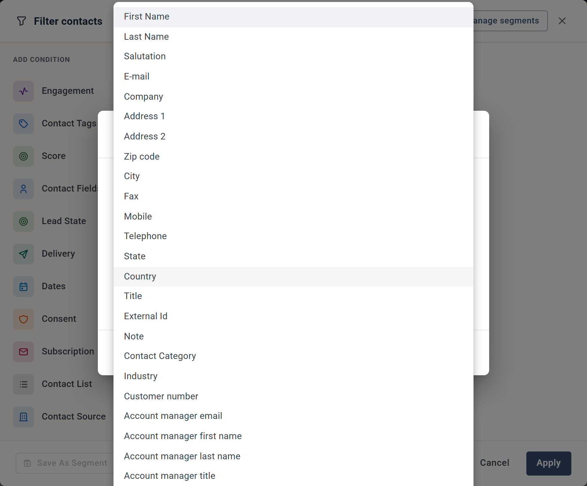
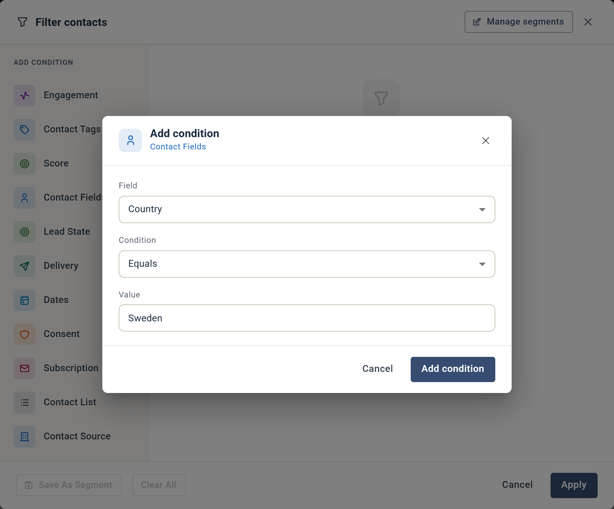

# Så bygger och använder du kontaktfilter

Filter låter dig segmentera kontakter efter vilka kriterier du än ställer in, från breda grupper till mycket specifika urval.

Den här artikeln går igenom filterbyggaren, visar några exempelfilter och täcker de åtgärder du kan utföra på ett urval av kontakter.


Journeys, leadströmmar och lead scoring-regler använder i stort sett samma dialogruta för att bygga sina villkor — vanligtvis med något färre alternativ. Att förstå den ger dig en bra grund för att arbeta effektivt med eMarketeers automatiserade sekvenser ([Journeys](../journeys/journeys.md)) och leadkvalificeringssystem ([Leadströmmar](../lead-board-scoring/lead-streams.md), [Lead scoring](../lead-board-scoring/how-lead-scoring-works-in-emarketeer.md)).


## Lär känna filterbyggaren

I eMarketeer, klicka på **Contacts** i sidomenyn till vänster. Det är här du arbetar med och lär känna dina kontakter. För att segmentera eller bygga ett urval, klicka på **Filter** precis ovanför kontaktlistan. Dialogrutan **Filter contacts** öppnas — det är här du bygger filter. Använd **Manage segments** högst upp i dialogrutan för att hitta de segment du har sparat.

Kolumnen **Add condition** till vänster listar varje kategori du kan filtrera på:

* Engagement
* Contact Tags
* Score
* Contact Fields (all information på kontaktkortet)
* Lead State
* Delivery
* Dates
* Consent
* Subscription
* Contact List
* Contact Source

## Bygg ett filter

För att bygga ett filter, klicka på en kategori och välj sedan ett lämpligt villkor — till exempel "Equals" eller "Not Equals". Vilka villkor som är tillgängliga beror på kategorin.

För ett enkelt exempel, segmentera kontakter efter land:

1. Klicka på **Contact Fields** och välj sedan **Country** i rullgardinsmenyn **Field**.

2. I rullgardinsmenyn **Condition**, välj "Equals".

3. Skriv landet i fältet **Value** och klicka på **Add condition**.

4. Klicka på **Apply**. Du ser nu alla kontakter som matchar filtret.

## Gör ett filter mer specifikt genom att lägga till kriterier

För att avgränsa ett filter, lägg till fler kriterier. Klicka på en kategori igen för att lägga till ett villkor till. Nya villkor kopplas ihop med AND. Klicka på etiketten **AND** mellan två villkor för att byta till **OR**.

* AND: kontakten måste matcha båda kriterierna.

* OR: kontakten måste matcha ett av kriterierna.

Du kan lägga till så många kriterier du vill och blanda AND och OR i samma filter.

## Filtrera på engagemang

Engagemangskategorin är värd att lyfta fram. Du kan filtrera kontakter efter hur de engagerade sig i din marknadsföring — till exempel om de fyllde i ett specifikt formulär, klickade på en länk i en e-post eller besökte en sida på din webbplats. Detta är användbart för att gruppera kontakter som har visat tillräckligt intresse för att skickas vidare till sälj, eller för att skicka uppföljande innehåll baserat på aktivitet.

## Spara segment

Spara ett filter som ett segment för att snabbt komma tillbaka till det. Klicka på **Save As Segment** i dialogrutan Filter contacts. Segment är inte personliga — varje användare på ditt konto kan se dem. Du hittar sparade segment under **Manage segments** i samma dialogruta och under **Segments** i menyn Contacts. Du kan också markera ett segment som favorit med stjärnan i **Manage segments** för att fästa det i menyn till vänster.

## Vad du kan göra med ditt urval av kontakter

### Bulk actions

Flera massåtgärder låter dig uppdatera varje kontakt i filtret samtidigt. Markera kontakterna med kryssrutorna i listan och klicka sedan på **Bulk actions**. Du kan uppdatera legal basis, ändra prenumerationer, lägga till kontakterna i en kontaktlista, lägga till taggar och mycket mer.

### Sätt ett segment som mottagare

För att skicka till kontakterna i ett segment:

1. Gå till utskicksalternativen för din e-post, där du lägger till mottagare.
2. Välj "eMarketeer contact data base".
3. Klicka på "contact filter".
4. I rullgardinen, välj det segment du vill skicka till. Filtret måste vara sparat som ett segment för att synas här.

Varje kontakt som matchar segmentet vid sändningstillfället tar emot e-posten.
