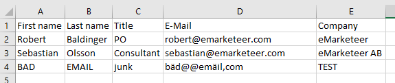
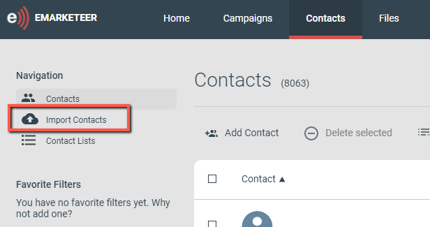
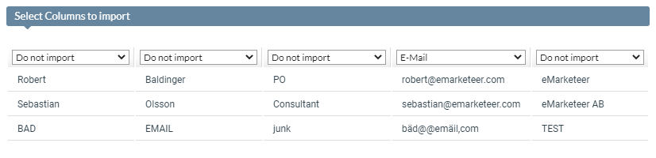

# Importera kontakter från Excel

Den här guiden beskriver hur du importerar kontakter till din eMarketeer-kontaktdatabas från Excel-dokument.

## Förberedelser

1. Strukturera din Excel-fil så att varje kolumn listar data av en enda typ och varje kontakt sitter på en ny rad.
2. Alla kontakter behöver giltiga e-postadresser, annars importeras de inte. Det gäller även när du importerar kontakter för SMS-utskick.
3. eMarketeer använder förnamn och efternamn som två separata fält. Fullt namn stöds inte, så dela upp kolumnerna i Excel.
4. Om du tänker uppdatera rättslig grund ([information om samtycke](../gdpr-consent/how-does-consent-work.md)) som en del av importen, se till att varje kontakt i filen delar samma rättsliga grund.

Exempel på en Excel-fil med 3 kontakter

## Var ska du importera?

Vid det här laget har du en Excel-fil redo att användas. Var du utför importen beror på vad du vill göra med kontakterna. Oftast vill du göra ett specifikt e-postutskick. Frågan är om du vill skicka till dem omedelbart eller lagra dem för senare.

### Importera som mottagarkälla

När du skickar e-post kan du välja en eller flera källor för dina mottagare. Alternativet File upload låter dig importera kontakter från en Excel-fil (eller textfil) och använda dem som mottagare i det utskicket. Det är ett effektivt sätt att använda kontakter från en fil utan att skapa en kontaktlista först.

[

Alternativet File upload när du skickar en e-post.

### Importera till en kampanj

Om du vill förbereda din kampanj inför utskicket kan du importera kontakterna direkt till [kampanjens kontaktlista](../campaigns/campaign-contacts.md). Du kan sedan använda alternativet "All Contacts in this Campaign" för att adressera det urvalet.

Observera att kampanjens kontaktlista uppdateras dynamiskt när nya kontakter interagerar med kampanjen, så det kan finnas ytterligare kontakter utöver dem från Excel-filen när du adresserar den här källan. Det här alternativet passar tomma kampanjer som du vill förbereda med kontakter i förväg, eller kampanjer där du vill lägga till en befintlig kontaktlista. Det passar inte för kampanjer med flera syften eller mottagartyper.

Alternativet Import contacts i en kampanj.

### Importera till en kontaktlista

Om du tänker använda kontakterna mer än en gång, lägg till dem i en kontaktlista. Du kan då adressera samma kontakter över flera utskick utan att importera om. Kontaktlistor används ofta för prenumerationslistor för nyhetsbrev, listor över interna kontakter eller en testgrupp för utkast till e-post.

Om du behöver skapa en ny kontaktlista som destination för din import visar [den här guiden](../getting-started/new-contact-list.md) hur du gör.

[

Alternativet Import Contacts på fliken Contacts.

## Import och fältmappning

När du har valt importmetod är nästa steg själva importen. Välj File Upload och välj Excel File.

Nästa vy innehåller instruktioner om hur du fortsätter:

1. Öppna din Excel-fil.
2. Markera cellerna du vill importera och kopiera dem.
3. Klistra in de kopierade cellerna i den tomma textrutan.
4. Klicka på Next.

Ett tomt textfält

### Fältmappning

Sedan väljer du vilka kolumner som ska importeras. Standardinställningen är Do not import om inte värdet i kolumnens första rad matchar en post i rullgardinsmenyn, då är den förvald. För att importera en kolumn, välj det alternativ som matchar dess datatyp. Till exempel ska kolumnen med e-postadresser sättas till E-Mail.

[

Matchning av kolumnen med eMarketeers kontaktfält

### Importalternativ

Som standard görs matchningen på e-postadress. Om en matchande e-postadress hittas uppdateras den befintliga kontakten med den nya informationen. Om ingen matchning hittas skapas en ny kontakt. Du kan också matcha på External ID om en av dina datakolumner har den datatypen. Det uppdaterar kontakter som delar ett External ID, vilket är användbart om du vill uppdatera deras e-postadress. Om ingen matchning hittas skapas en ny kontakt.

Om importen körs under Contacts kan du också importera kontakter till en befintlig kontaktlista med alternativet Import to List.

Importalternativ

### Rättslig grund

Slutligen kan du uppdatera den rättsliga grunden för kontakterna i din fil. Det skapar eller uppdaterar den rättsliga grunden för varje importerad kontakt, så se till att ditt urval korrekt återspeglar den rättsliga grunden för varje individ i filen. [Läs mer om samtycke här](../gdpr-consent/how-does-consent-work.md).

Ett återkallat samtycke ändras inte av en kontaktimport. Du kan inte återkalla ett återkallande genom import.

[

Exempel på hur du anger "Consent" som Legal Basis för varje Purpose.

När du är redo, klicka på Import Contacts för att starta importen. Tiden det tar beror på antalet kontakter och kolumner. En liten lista med några hundra kontakter och en handfull kolumner tar vanligtvis några sekunder, medan större listor tar längre tid. En förloppsindikator visas under importen.

När importen är klar visar resultaten hur många kontakter som uppdaterades, skapades och hoppades över. Om importen inte gav det förväntade resultatet hjälper den här rapporten dig att förstå problemet. Kontakter med ogiltiga e-postadresser visas i textfältet "Bad e-mail addresses" (synligt efter att du klickat på Show list). Du kan kopiera den texten till ett annat Excel-dokument för granskning.

Resultatet av importen
