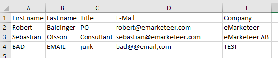
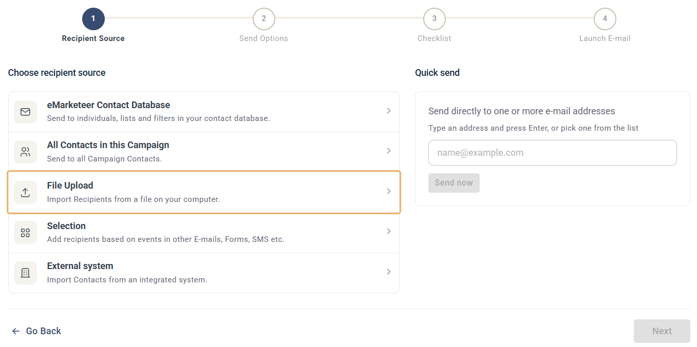
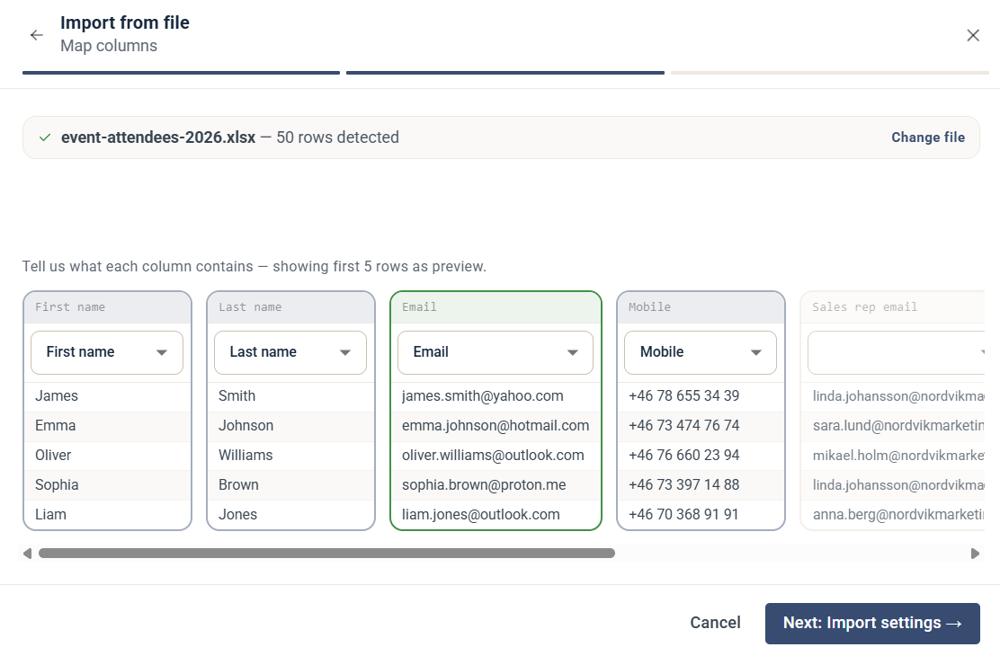
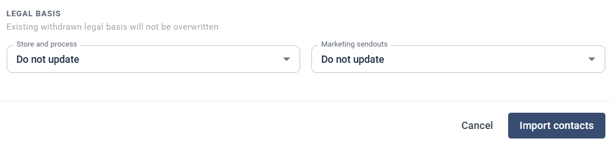
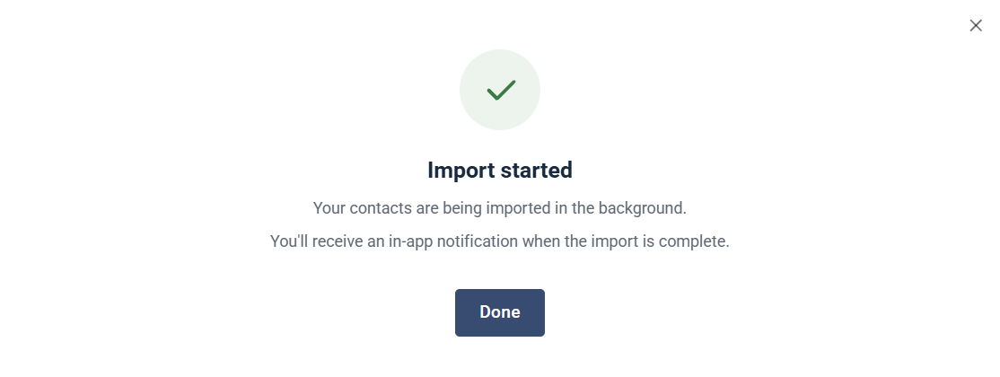

# Importera kontakter från Excel

Den här guiden beskriver hur du importerar kontakter till din eMarketeer-kontaktdatabas från Excel-dokument.

## Förberedelser

1. Strukturera din Excel-fil så att varje kolumn listar data av en enda typ och varje kontakt sitter på en ny rad.
2. Alla kontakter behöver giltiga e-postadresser, annars importeras de inte. Det gäller även när du importerar kontakter för SMS-utskick.
3. eMarketeer använder förnamn och efternamn som två separata fält. Fullt namn stöds inte, så dela upp kolumnerna i Excel.
4. Om du tänker uppdatera rättslig grund ([information om samtycke](../gdpr-consent/how-does-consent-work.md)) som en del av importen, se till att varje kontakt i filen delar samma rättsliga grund.

## Var ska du importera?

Vid det här laget har du en Excel-fil redo att användas. Var du utför importen beror på vad du vill göra med kontakterna. Oftast vill du göra ett specifikt e-postutskick. Frågan är om du vill skicka till dem omedelbart eller lagra dem för senare.

### Importera som mottagarkälla

När du skickar e-post kan du välja en eller flera källor för dina mottagare. Alternativet File upload låter dig importera kontakter från en Excel-fil (eller textfil) och använda dem som mottagare i det utskicket. Det är ett effektivt sätt att använda kontakter från en fil utan att skapa en kontaktlista först.

### Importera till en kontaktlista

Om du tänker använda kontakterna mer än en gång, lägg till dem i en kontaktlista. Du kan då adressera samma kontakter över flera utskick utan att importera om. Kontaktlistor används ofta för prenumerationslistor för nyhetsbrev, listor över interna kontakter eller en testgrupp för utkast till e-post.

Om du behöver skapa en ny kontaktlista som destination för din import visar [den här guiden](../getting-started/new-contact-list.md) hur du gör.

För att starta importen går du till **Contacts** i vänstermenyn, klickar på **Add Contact** och väljer **Import from file**.

## Import och fältmappning

### Mappa kolumner

I fönstret **Import from file** drar och släpper du din Excel- eller CSV-fil, eller bläddrar fram den. eMarketeer visar hur många rader den hittade och en förhandsvisning av de fem första raderna.

Välj för varje kolumn vilket kontaktkortsfält den innehåller i rullgardinsmenyn ovanför den. Kolumner vars rubrik matchar ett fält mappas automatiskt. Kolumner utan fält importeras inte. Ställ till exempel in kolumnen med e-postadresser på **Email**. Klicka sedan på **Next: Import settings**.

### Kontaktinställningar och befintliga kontakter

Under **Contact settings** kan du lägga till taggar på alla importerade kontakter, ange deras **Contact type** och lägga till dem i en kontaktlista med **Import to contact list**.

Under **Existing contacts** avgör **Match by** hur eMarketeer känner igen kontakter som redan finns i din databas. Som standard matchas på e-postadress: en matchande kontakt uppdateras, och en ny kontakt skapas om ingen matchning hittas. Du kan också matcha på External ID om någon av dina kolumner har den datatypen, vilket är användbart om du vill uppdatera e-postadresser. **Update behavior** styr hur befintliga kontakter uppdateras.

### Rättslig grund

Slutligen kan du uppdatera den rättsliga grunden för kontakterna i din fil, för **Store and process** och **Marketing sendouts**. Båda är inställda på **Do not update** som standard. En uppdatering skapar eller uppdaterar den rättsliga grunden för varje importerad kontakt, så se till att ditt urval korrekt återspeglar den rättsliga grunden för varje individ i filen. [Läs mer om samtycke här](../gdpr-consent/how-does-consent-work.md).

Ett återkallat samtycke ändras inte av en kontaktimport. Du kan inte återkalla ett återkallande genom import.

### Starta importen

Klicka på **Import contacts**. Importen körs i bakgrunden, så du kan klicka på **Done** och fortsätta arbeta medan den blir klar.

### Importresultat

När importen är klar får du en notis i inkorgen under klockikonen uppe till höger. Den visar hur många kontakter som lades till, uppdaterades, hoppades över och avvisades. Klicka på **View report** för att öppna importrapporten.

Rapporten visar antalet kontakter som skapades, uppdaterades, hoppades över och avvisades. Om importen inte gav det förväntade resultatet hjälper rapporten dig att ta reda på varför. Rader som inte kunde importeras, till exempel på grund av en ogiltig e-postadress, listas under **Invalid rows**.

