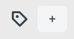
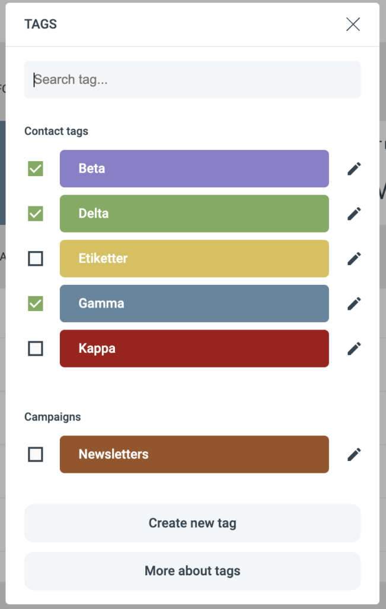

# Taggar

Taggar är nyckelord som du tilldelar kontakter och kampanjer för att klassificera dem.

En tagg är en information som beskriver de data eller det innehåll den är tilldelad. Taggar är icke-hierarkiska nyckelord som används för bokmärken, bilder, videor, filer och så vidare. En tagg bär inte någon information eller semantik på egen hand.

Taggning fyller flera syften, bland annat:

* Klassificering.
* Markera ägarskap.
* Beskriva innehållstyp.
* Identitet online.

### Så används taggar i eMarketeer

Taggar kan användas på kampanjer och kontakter för många syften.

#### Kampanjer

Taggar på kampanjer låter dig definiera vad kampanjen handlar om. Tagga till exempel dina nyhetsbrevskampanjer med "Newsletters" och "Sweden" medan du taggar andra kampanjer med "Events" och ett specifikt produktområde.

Taggar på kampanjer låter dig separera engagemang i filtret efter tagg — till exempel få fram alla kontakter som svarade på något event-formulär, eller alla kontakter som öppnade något svenskt nyhetsbrev.

#### Kontakter

Taggar på kontakter hjälper dig att segmentera på ett mer nyanserat sätt. Sätt taggar manuellt på en kontakt, använd bulk action för att tagga en lista med kontakter, eller använd Journeys för att lägga till eller ta bort taggar när kontakter utför vissa åtgärder.

### Tagg-widgeten

Du hittar tagg-widgeten i en kampanj (övre högra hörnet) eller på kontaktkortet. För att lägga till en tagg, klicka på plus-ikonen bredvid tagg-widgeten för att öppna den.

#### Tagg-kategorier

Varje tagg hör till en kategori. Kategorier grupperar relaterade taggar — till exempel "Contact interests", "Contact types" eller en kategori bara för kampanjer.

#### Skapa en ny tagg

Om taggen du vill ha inte finns, skapa den genom att klicka på "Create new tag".

Ge taggen en titel. I rullgardinen, välj kategorin den hör till. Om ingen kategori passar, skriv in ett nytt kategorinamn så skapas det. Välj en färg för taggen och klicka på "Create tag".

#### Ta bort en tagg

För att ta bort en tagg helt, öppna tagg-widgeten och klicka på edit-knappen bredvid taggens titel. Klicka sedan på "Delete". Det tar bort taggen från eMarketeer och från alla kontakter och kampanjer som använde den.

### Lägga till taggar på kontakter eller kampanjer

I listan över taggar, kryssa i kryssrutan framför taggen du vill tilldela.

### Ta bort taggar från en kontakt eller kampanj

Det finns två sätt att ta bort en tagg:

1.  I kampanjen eller på kontaktkortet, för muspekaren över en tagg och klicka på "x" för att ta bort den.

    

2. Öppna tagg-widgeten och avmarkera kryssrutan framför taggen.
