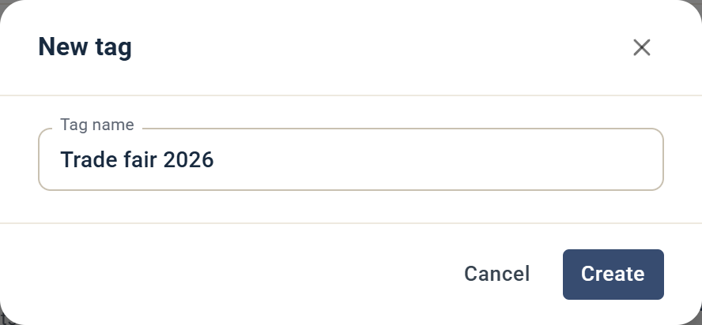

# Taggar

Taggar är nyckelord som du tilldelar kontakter och kampanjer för att klassificera dem.

En tagg är en information som beskriver de data eller det innehåll den är tilldelad. Taggar är icke-hierarkiska nyckelord som används för bokmärken, bilder, videor, filer och så vidare. En tagg bär inte någon information eller semantik på egen hand.

Taggning fyller flera syften, bland annat:

* Klassificering.
* Markera ägarskap.
* Beskriva innehållstyp.
* Identitet online.

### Så används taggar i eMarketeer

Taggar kan användas på kampanjer och kontakter för många syften.

#### Kampanjer

Taggar på kampanjer låter dig definiera vad kampanjen handlar om. Tagga till exempel dina nyhetsbrevskampanjer med "Newsletters" och "Sweden" medan du taggar andra kampanjer med "Events" och ett specifikt produktområde.

Taggar på kampanjer låter dig separera engagemang i filtret efter tagg — till exempel få fram alla kontakter som svarade på något event-formulär, eller alla kontakter som öppnade något svenskt nyhetsbrev.

#### Kontakter

Taggar på kontakter hjälper dig att segmentera på ett mer nyanserat sätt. Sätt taggar manuellt på en kontakt, använd bulk action för att tagga en lista med kontakter, eller använd Journeys för att lägga till eller ta bort taggar när kontakter utför vissa åtgärder.

### Tagg-widgeten

Du hittar tagg-widgeten i en kampanj (övre högra hörnet) eller på kontaktkortet (övre högra hörnet). För att lägga till en tagg, klicka på tagg-ikonen för att öppna den.

Widgeten listar alla taggar i ditt konto. Skriv i sökfältet för att hitta en tagg.

#### Skapa en ny tagg

Om taggen du vill ha inte finns, skriv in dess namn i tagg-widgeten och välj **Create new "<name>" tag**.

Du kan också skapa taggar under **Contacts** > **Tags**. Klicka på **Create tag**, ge taggen ett namn och klicka på **Create**.

#### Ta bort en tagg

För att ta bort en tagg helt, gå till **Contacts** > **Tags** och klicka på ta bort-ikonen bredvid taggen. Det tar bort taggen från eMarketeer och från alla kontakter och kampanjer som använde den. Använd redigeringsikonen för att byta namn på en tagg.

### Lägga till taggar på kontakter eller kampanjer

Öppna tagg-widgeten och välj den tagg du vill tilldela i listan.

### Ta bort taggar från en kontakt eller kampanj

I kampanjen eller på kontaktkortet, klicka på "x" på taggen för att ta bort den. I en kampanj visas "x" när du håller muspekaren över taggen.

