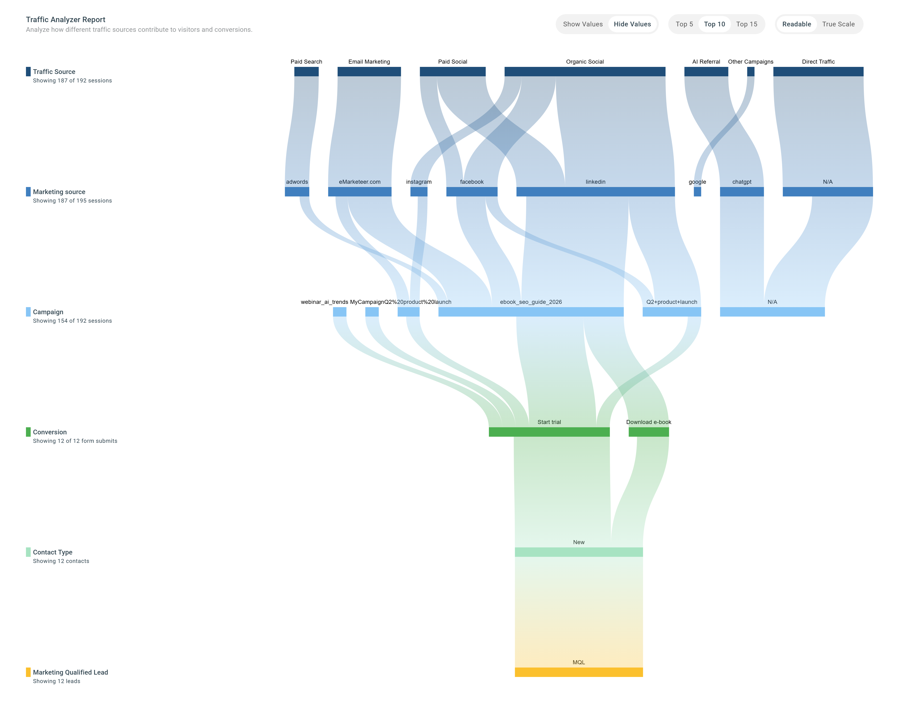
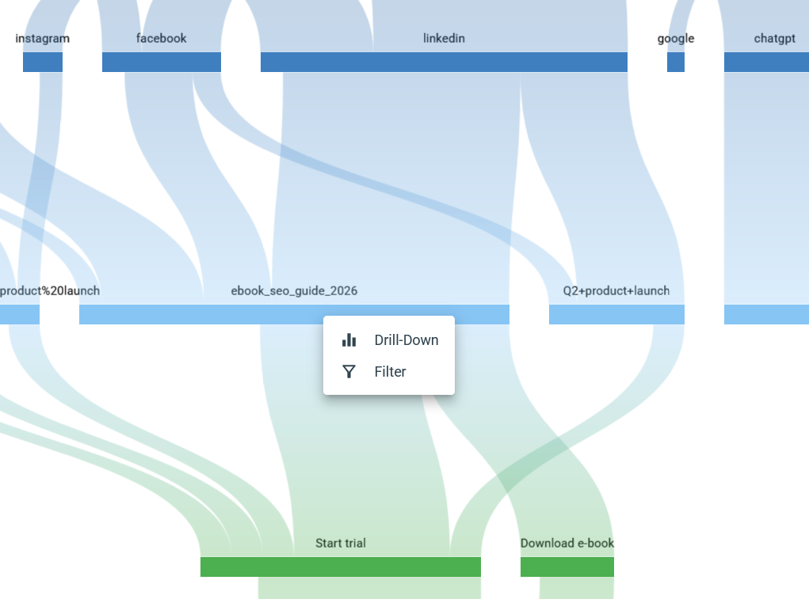

# Trafikanalysator

Trafikanalysator visualiserar hela ditt marknadsföringsflöde, från första kontakt till kvalificerad lead. Den visar hur besökare rör sig genom din marknadsföring i en sammanhängande vy, i stället för som separata siffror i separata rapporter.

Använd den för att förstå vilka källor som driver trafik av hög kvalitet, se vilka kampanjer och vilket innehåll som bidrar till konverteringar, och upptäcka var besökare faller ifrån längs vägen.

## Det här kan du använda den till

* Identifiera de källor som genererar flest leads, inte bara mest trafik.
* Se vilka kampanjer och vilket innehåll som för människor närmare konvertering.
* Hitta de punkter där besökare faller ur flödet.
* Spåra vilka insatser som i slutänden ger marketing qualified leads.

## Läsa flödet

Trafikanalysator ritar din marknadsföring som ett flöde som läses från vänster till höger. Varje steg matar nästa, och bredden på varje väg speglar hur mycket volym som rör sig genom den.

Stegen är:

1. **Traffic Source** — var besöket har sitt ursprung.
2. **Marketing source** — kanalen eller mediet bakom trafiken.
3. **Campaign** — den specifika kampanj som är kopplad till besöket, avläst från parametern `utm_campaign`. eMarketeer lägger automatiskt till UTM-parametrar i sina egna länkar (till exempel länkar i e-post) och använder eMarketeer-kampanjens namn som `utm_campaign`. För bästa spårbarhet bör du tagga även dina övriga länkar konsekvent.
4. **Conversion** — den konvertering besöket gav. Detta spårar inskickade eMarketeer-formulär som är inbäddade på din webbplats.
5. **Contact Type** — vilken typ av kontakt som konverterade: ny eller befintlig.
6. **Marketing Qualified Lead** — om kontakten blev en MQL under den valda perioden.

Att följa en väg från vänster till höger visar hela resan: vilken källa, via vilken kampanj, som ledde till vilka konverteringar och i slutänden till kvalificerade leads.

## Kontroller

En uppsättning kontroller låter dig forma vyn:

* **Show/Hide Values** — slå på eller av de numeriska etiketterna på varje väg.
* **Top 5 / Top 10 / Top 15** — begränsa vyn till de starkaste vägarna så att flödet förblir läsbart.
* **Readable** vs. **True Scale** — växla mellan en balanserad layout och en där bredderna speglar exakta proportioner.
* **Datumintervall** — fokusera flödet på en egen period.

## Nodalternativ

Klicka på valfri nod i flödet för att öppna två alternativ: **Drill down** och **Filter**.

### Borra ner i en nod

Det är här det blir intressant. Drill down-rapporten visar hur en enskild nod förhåller sig till resten av din trafik — sessionerna, konverteringarna och leadsen bakom den.

Några exempel:

* **Paid Social** — borra ner för att se hur dina paid social-kanaler presterar under perioden: hur många sessioner de skapade, hur många konverteringar och hur många leads (MQL) som kom från den källan.
* **Campaign** — borra ner på en specifik kampanj för att se hur den presterar i siffror: vilka traffic sources och marketing sources som drev mest trafik till den, och hur väl den konverterar och genererar leads.
* **MQL** — för att se vad som driver nya leads, borra ner på MQL-noden. Den rangordnar traffic sources, marketing sources, kampanjer och konverteringspunkter i varje steg, så att du ser vad som presterar bäst. För att komma igång med leads, se [Leadhantering](../lead-board-scoring/README.md).

### Filter

Välj **Filter** för att begränsa hela rapporten till bara den trafik som passerade den valda noden. Det är ett annat sätt att se det drill down-rapporten visar, direkt i flödet.

## Krav

Trafikanalysator kräver Web Tracker installerad på din webbplats. Utan den har flödet ingen trafikdata att rita från.

## Nästa steg

För en mer övergripande vy över kampanjer, konverteringar och leads, öppna [Marknadsföringsresultat](marketing-performance.md).
