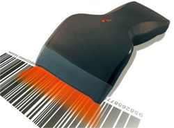

# Streckkoder

Den här artikeln förklarar vad streckkoder är, var de används och hur du kan använda dem i eMarketeer.

## Vad är en streckkod?

En streckkodsläsare som läser en streckkod

En streckkod är i grunden ett typsnitt som datorer kan läsa visuellt. För att läsa en behöver en dator en streckkodsläsare — dess "ögon". Som med vilket typsnitt som helst kan du koda in vad du vill: siffror, text eller hela meningar. Det du kodar in spelar bara roll om det betyder något för någon, eller något, i andra änden.

Det här telefonnumret i ett vanligt typsnitt:
`004651410050`

Dina ögon läser siffrorna och vet vad de ska göra med dem.

Samma nummer som streckkod ser ut så här:

## Var används streckkoder?

Den vanligaste platsen är din lokala butik. "Pipet" i kassan är en streckkodsläsare som scannar in varje produkt i kassaregistret. Du ser också streckkoder på biljetter, kuponger, paket, ID-kort och mer.

## Hur kan jag använda streckkoder med eMarketeer?

Du behöver två system: ett för att generera koderna och ett för att läsa av dem. eMarketeer transporterar koden från det ena till det andra.

Anta till exempel att du vill skicka kuponger till dina kunder. Du har redan artikelnummer för varorna och ett kassaregister som läser streckkoder. eMarketeer tar informationen och skickar ett färdigt e-postmeddelande med erbjudandena och streckkoderna inkluderade. Kunderna skriver ut e-postmeddelandet, tar med det till butiken och kassaregistret läser av streckkoden för att tillämpa rabatten.

## Streckkodsstandarder

eMarketeer har stöd för följande streckkodsstandarder. Standardvalet i eMarketeer-blocken är **Code 128**. För att ändra standard redigerar du streckkoden i Developer Mode.

- Code 128
- Codabar
- Code 11
- Code 39
- Code 39 Extended
- Code 93
- EAN-8
- EAN-13
- ISBN-10 / ISBN-13
- Interleaved 2 of 5
- Standard 2 of 5
- MSI Plessey
- UPC-A
- UPC-E
- UPC Extension 2
- UPC Extension 5
- PostNet
