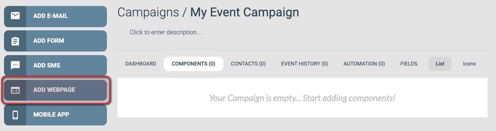
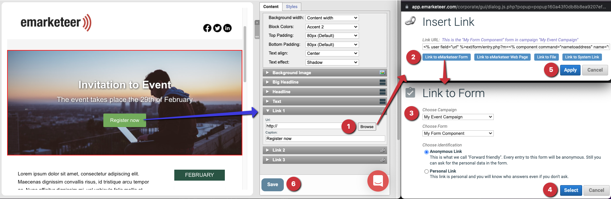
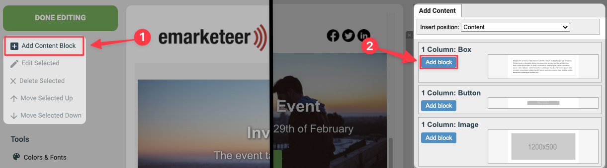
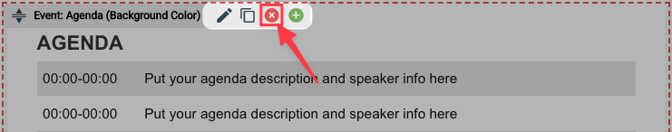

# Skapa din första webbsida

Bygg en webbsida i eMarketeer som du kan använda som event-landningssida, nyhetsartikel eller annan fristående sida.

Den här guiden går igenom hur du skapar en webbsidekomponent, redigerar dess innehållsblock och färdigställer sidan.

---

### 1. Klicka på [Add Webpage] från kampanjsidan

Om du först behöver skapa kampanjen, se [Skapa en ny kampanj](../getting-started/create-new-campaign.md).

Knappen [Add Webpage]

### 2. Fyll i inställningarna och välj en mall

Inställningar för webbsidan

#### Inställningar

- **Name your webpage**: Ett unikt namn så att du hittar sidan senare. Använd något som beskriver sidans roll i kampanjen. Besökarna ser inte detta namn.
- **Page title**: Titeln som besökarna ser i webbläsarens flik.

#### Mall

Välj en mall från en av flikarna som utgångspunkt för designen. Den här guiden använder *Simple Landing (R)* från fliken Landing Pages. Mallar som sparats på ditt konto visas under fliken My Templates.

#### Skapa webbsidekomponenten

Klicka på [Create Web Page] för att skapa komponenten.

### 3. Webbsideredigeraren

Efter att komponenten skapats öppnas redigeraren med mallens innehåll på plats. Vänstermenyn låter dig lägga till innehållsblock, öppna verktyg och justera inställningarna från steg 2. Resten av sidan visar det nuvarande innehållet, uppbyggt av block som du kan redigera ett i taget.

Webbsidans redigeringsvy

## 4. Redigera ett innehållsblock

Varje innehållsblock består av flera delar. Klicka på Edit-knappen på blocket för att öppna dess redigerare.

Redigering av ett innehållsblock på webbsidan

Inställningspanelen öppnas till höger med två flikar: Content och Styles. Content innehåller blockets text, bilder och länkar. Styles innehåller färger och typsnitt. På fliken Content styr den övre delen hur blocket visas — oftast lämnar du standardvärdena — och den nedre delen är där du redigerar själva innehållet.

### 5. Ändra en rubrik

Klicka på titelraden för den del du vill ändra och redigera sedan texten i textrutan. En tom textruta döljer den delen av blocket. I exemplet nedan är textstycket och de två länkknapparna tomma, så de visas inte på sidan. Klicka på [Save] för att behålla dina ändringar.

Redigering av rubriktexten i ett block

### 6. Ändra bilden i ett block

Öppna blocket för redigering, gå till Image-sektionen till höger och klicka på [Choose Image].

Knappen [Choose Image]

För att ladda upp en egen bild:

1. Klicka på [Upload File].
2. Klicka på [Choose files] och välj bilden från din dator.
3. Ladda upp filen till ditt eMarketeer-konto.
4. Markera den uppladdade filen i filbläddraren.
5. Klicka på [Use Selected] för att lägga till den i innehållsblocket.

Steg för att ladda upp och använda en ny bildfil

Om bilden inte matchar de rekommenderade måtten visas ett alternativ för automatisk skalning. Klicka på länken i meddelandet för att skala bilden automatiskt.

Alternativet Auto Scale

### 7. Lägga till en knapp med en länk

Knappar kan länka till en webbsida, en fil eller en annan eMarketeer-komponent. För en extern webbplats klistrar du in hela URL:en — inklusive `http://` eller `https://` — i URL-fältet och skriver en text för knappen.

För att länka till ett formulär:

1. Öppna innehållsinställningarna för Link 1 och klicka på [Browse].
2. Klicka på [Link to eMarketeer Form].
3. Välj kampanjen som innehåller ditt formulär och välj sedan själva formuläret.
4. Klicka på [Select], sedan [Apply] och sedan [Save] för att koppla länken och spara blocket.

Uppdatera knapplänk i innehållsblock

### 8. Lägga till ytterligare ett innehållsblock

Klicka på [Add Content Block] i vänstermenyn och klicka sedan på [Add Block] bredvid den blocktyp du vill ha. Om knappen är grå klickar du först på ett befintligt block på sidan så att redigeraren vet var det nya blocket ska placeras.

Add Content Block för att öppna menyn och sedan Add för det specifika blocket du vill ha

### 9. Flytta ett innehållsblock

Klicka och håll ned flyttikonen till vänster om blockets kontextfält och dra sedan blocket till den nya positionen.

Flytta blocket genom att dra det på plats

### 10. Ta bort ett innehållsblock

Om mallen innehåller ett block som du inte behöver klickar du på ta bort-knappen på blockets kontextfält.

Knappen för att ta bort innehållsblock

### 11. Färdigställ webbsidan

Klicka på [Done Editing] för att lämna redigeraren.

Knappen [Done Editing]
