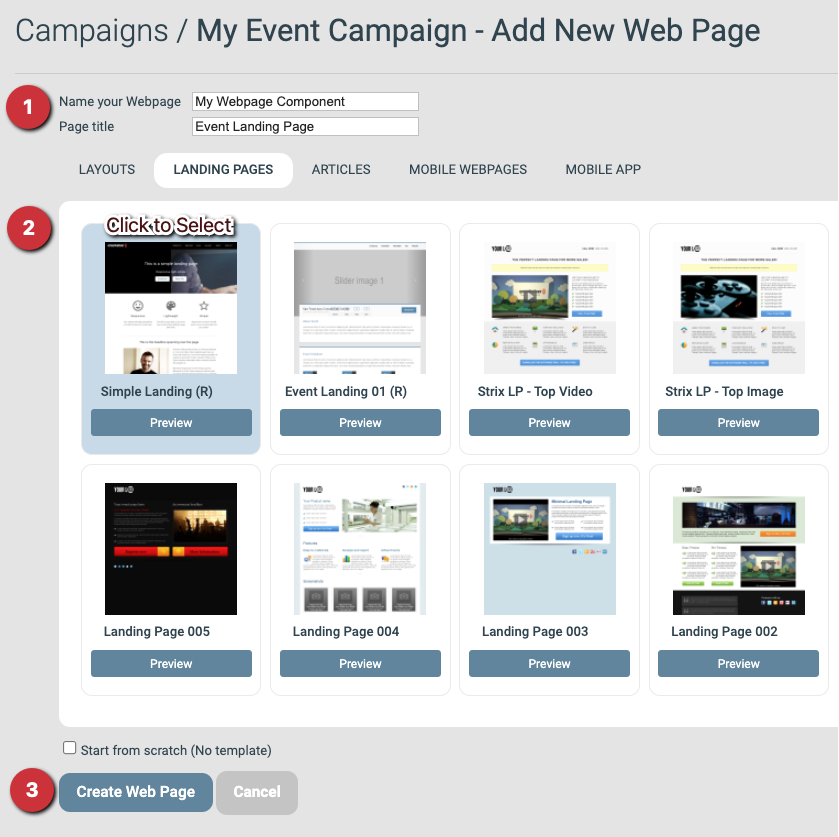
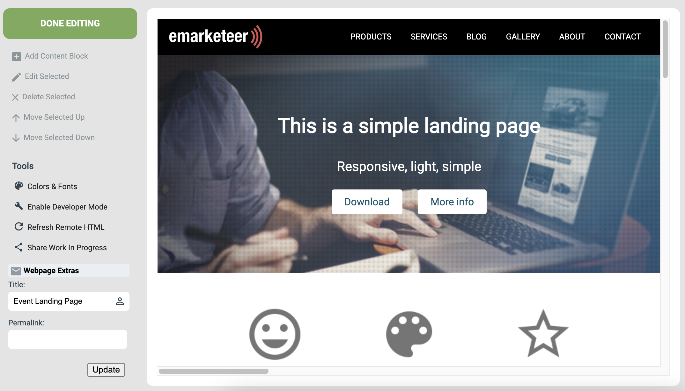

# Skapa din första webbsida


Du behöver en kampanj innan du kan lägga till en webbsida. Se [Skapa en ny kampanj](../getting-started/create-new-campaign.md) om du inte har skapat en ännu.



Exemplet bygger en event-landningssida, men processen är densamma för alla typer av webbsidor. I slutet av guiden har du en webbsida redo att publicera.




### Lägg till en webbsida från kampanjsidan

Klicka på **Add Webpage** från kampanjsidan.




### Fyll i inställningar och välj en mall

**Inställningar**

* **Name your webpage:** Ett unikt namn så att du hittar sidan senare. Välj något som beskriver sidans roll i kampanjen. Besökarna ser inte detta namn.
* **Page title:** Titeln som besökarna ser i webbläsarens flik.

**Mall**

Välj en mall från en av flikarna som utgångspunkt för designen. Den här guiden använder **Simple Landing (R)** från fliken **Landing Pages**. Mallar som sparats på ditt konto visas under **My Templates**.

**Skapa webbsidekomponenten**

När inställningar och mall är valda klickar du på **Create Web Page** för att skapa komponenten.



### Webbsideredigeraren

När du klickar på **Create Web Page** öppnas redigeraren med mallens innehåll på plats. Vänstermenyn låter dig lägga till innehållsblock, öppna verktyg och justera inställningarna från föregående steg. Resten av sidan visar det nuvarande innehållet, uppbyggt av block som du redigerar ett i taget.




### Redigera ett innehållsblock

Varje innehållsblock består av flera delar som du kan uppdatera. Klicka på blockets **Edit**-knapp för att öppna dess inställningar.

En inställningspanel öppnas till höger med två flikar: **Content** och **Styles**. Content är där du ändrar blockets text, bilder och länkar. Styles är där du ändrar färger och typsnitt.

På fliken Content styr den övre delen hur blocket visas — lämna dessa standardvärden för nu. Den nedre delen är där du redigerar det faktiska innehållet.



### Ändra en rubrik

För att ändra en rubrik eller ett textstycke klickar du på dess titelrad och redigerar texten i textrutan. En tom textruta döljer den delen av blocket.

I exemplet nedan är textstycket och de två länkknapparna tomma, så de visas inte på sidan.

Klicka på **Save** efter varje ändring.




### Ändra bilden i ett block

Öppna blocket för redigering, gå till Image-sektionen i den högra panelen och klicka på **Choose Image**.

Gör så här för att ladda upp och använda en egen bild:

1. Klicka på **Upload File**.
2. Klicka på **Choose files** och välj bilden på din dator.
3. Ladda upp filen till ditt eMarketeer-konto.
4. Klicka på filen i webbläsarfönstret för att markera den.
5. Klicka på **Use Selected** för att lägga till den i innehållsblocket.

Om bilden inte matchar de rekommenderade måtten för blocket visas ett alternativ för automatisk skalning. Klicka på länken i meddelandet för att godkänna.




### Lägg till en knapp med en länk

Använd knappar för att länka till en webbsida, en fil eller en annan eMarketeer-komponent. För en webblänk skriver du URL:en i länkinställningarna (inkludera `http://` eller `https://`) och skriver en knapptext. Gör så här för att länka till ett formulär:

1. Öppna innehållsinställningarna för Link 1 och klicka på **Browse**.
2. Klicka på **Link to eMarketeer Form**.
3. Välj kampanjen som innehåller ditt formulär och välj sedan formuläret.
4. Klicka på **Select**, sedan **Apply** och sedan **Save** för att lägga till länken och spara blocket.




### Lägg till ett nytt innehållsblock

Klicka på **Add Content Block** i vänstermenyn och klicka sedan på **Add Block** bredvid den blocktyp du vill ha.

Om knappen är grå klickar du först på ett befintligt block för att tala om för redigeraren var det nya blocket ska placeras.




### Flytta ett innehållsblock

För att flytta ett block klickar du på och håller ned flytt-ikonen till vänster om blockets kontextfält och drar det sedan till den nya positionen.




### Ta bort ett innehållsblock

För att ta bort ett block du inte behöver klickar du på ta bort-knappen på dess kontextfält.




### Färdigställ webbsidan

Klicka på **Done Editing** för att lämna redigeraren.



