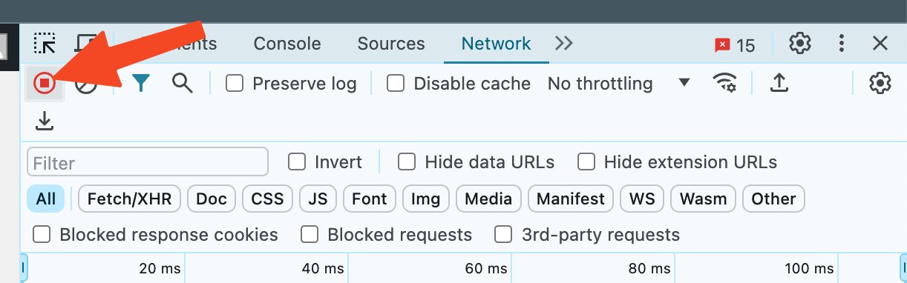

# Skapa en HAR-fil för supporten

En HAR-fil registrerar varje nätverksdetalj i din webbläsare medan du återskapar ett problem i eMarketeer, vilket hjälper supporten att diagnostisera problemet.

Om supporten ber om en HAR-fil öppnar du eMarketeer på platsen där problemet uppstår, startar inspelningen, återskapar problemet och sparar sedan och skickar filen.

#### För webbläsaren Chrome

1. Öppna Chrome och gå till sidan där problemet uppstår.

2. Klicka på ⋮-menyn och välj More Tools > Developer Tools.

3. I panelen som öppnas väljer du fliken Network. Håll panelen öppen medan du återskapar problemet.

4. Rensa loggarna innan du återskapar problemet genom att klicka på rensa-knappen.

5. Leta efter den runda inspelningsknappen längst upp till vänster på fliken. Se till att den är röd. Om den är grå klickar du på den en gång för att starta inspelningen.

6. Om den inte är det kryssar du i rutan Preserve log.

7. Återskapa problemet medan nätverksanrop spelas in.

8. Klicka på nedladdningsknappen, Export HAR, och spara filen till din dator som HAR with Content.

9. Ladda upp HAR-filen till ditt ärende hos eMarketeer Support för vidare utredning.
