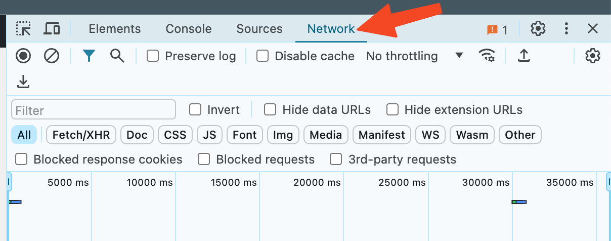
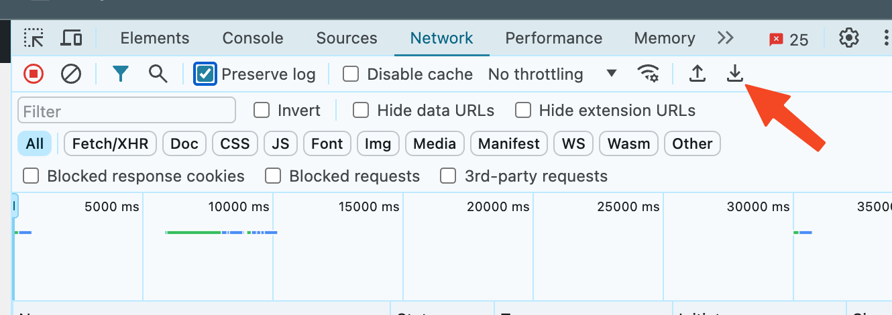

# Skapa en HAR-fil för supporten

En HAR-fil registrerar varje nätverksdetalj i din webbläsare medan du återskapar ett problem i eMarketeer, vilket hjälper supporten att diagnostisera problemet.

Om supporten ber om en HAR-fil öppnar du eMarketeer på platsen där problemet uppstår, startar inspelningen, återskapar problemet och sparar sedan och skickar filen.

## För Chrome



### Öppna problemsidan

Öppna Chrome och gå till sidan där problemet uppstår.



### Öppna Developer Tools

Klicka på ⋮-menyn och välj More Tools > Developer Tools.



### Öppna Network-fliken

I panelen som öppnas väljer du fliken Network. Håll panelen öppen medan du återskapar problemet.




### Rensa loggarna

Rensa loggarna innan du återskapar problemet genom att klicka på rensa-knappen.




### Markera inspelningsknappen

Leta efter den runda inspelningsknappen längst upp till vänster på fliken. Se till att den är röd. Om den är grå klickar du på den en gång för att starta inspelningen.




### Aktivera Preserve log

Om den inte redan spelar in, kryssa i rutan Preserve log.




### Återskapa problemet

Återskapa problemet medan nätverksanrop spelas in.



### Exportera HAR-filen

Klicka på nedladdningsknappen, Export HAR, och spara filen till din dator som HAR with Content.




### Skicka filen till supporten

Ladda upp HAR-filen till ditt ärende hos eMarketeer Support för vidare utredning.


