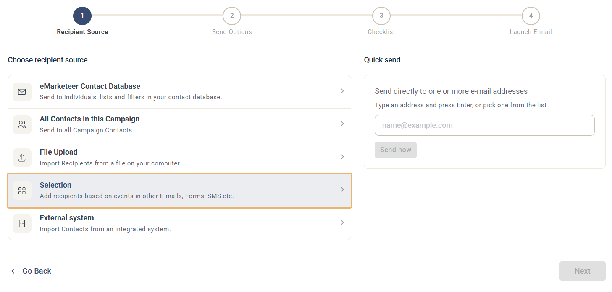
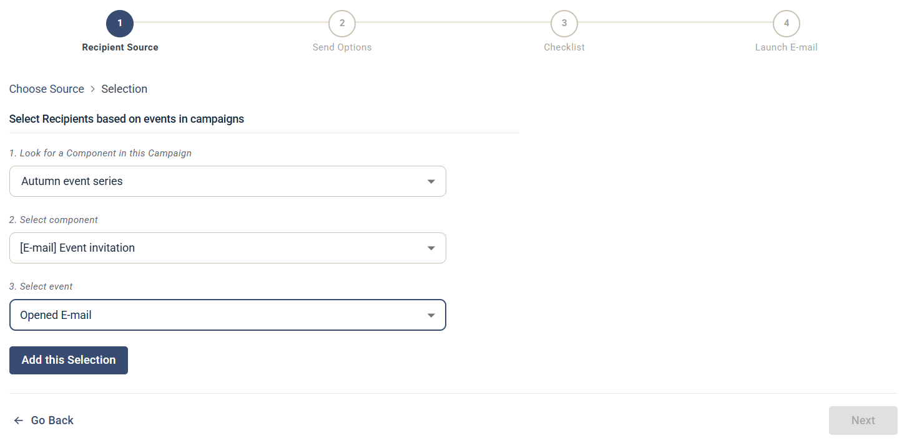
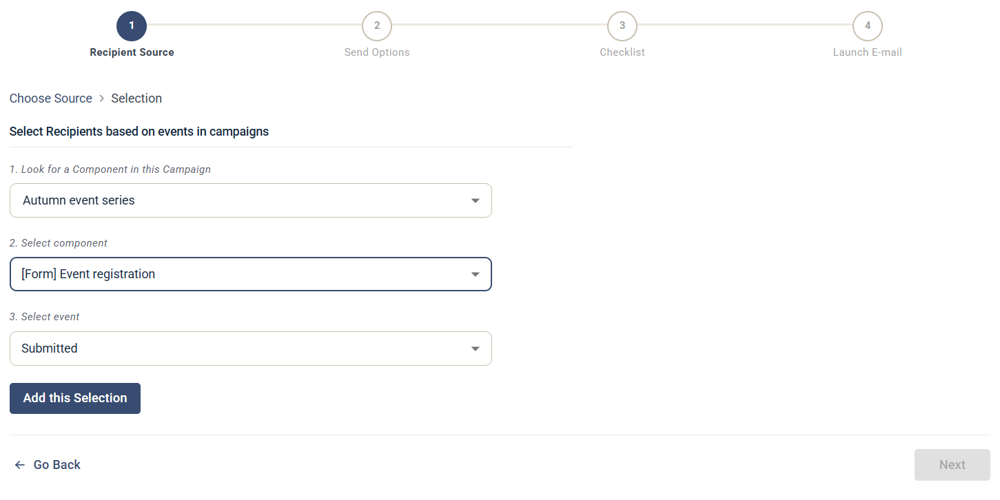
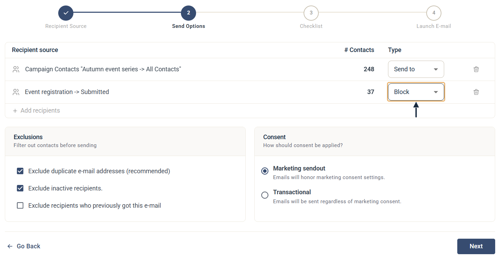

# Så skickar du påminnelsemejl

Skapa en uppföljningskampanj som automatiskt hoppar över kontakter som redan engagerat sig i det ursprungliga utskicket.

eMarketeers påminnelsemönster använder ett dynamiskt urval av kontakter baserat på engagemang i en tidigare komponent, exempelvis ett e-postmeddelande eller ett formulär. Urvalet uppdateras över tid, så du kan bygga påminnelsen innan den ursprungliga kampanjen går ut och lita på att den bara når de kontakter som fortfarande behöver en knuff.

Den här guiden täcker två vanliga scenarier: påminna kontakter att läsa ett e-postmeddelande de inte öppnat, och påminna kontakter att registrera sig via ett formulär de inte skickat in.



### Skapa en e-postkomponent att använda som påminnelse

Om du inte har byggt påminnelse-mejlet ännu, se guiden om att [skapa ett e-postmeddelande](../getting-started/basics-send-email.md).



### Starta skickaprocessen och lägg till de ursprungliga mottagarna

Välj samma kontaktgrupp som du använde för den ursprungliga kampanjen som din första Recipient Source. Om du vill skicka påminnelsen senare, välj **Scheduled Send** som utskickstyp i första steget.



### På Steg 2, Send Options, klicka på + Add recipients

Använd den här knappen för att lägga till det urval av kontakter du vill blockera från påminnelsen.

Länken + Add recipients på sidan Send Options



### Välj "Selection" som andra Recipient Source

Selection är ett av alternativen på första Recipient Source-sidan



### Välj det urval som matchar din påminnelse

Vilket urval du väljer beror på vad påminnelsen handlar om. De två exemplen nedan täcker en e-postöppning och ett formulärsvar, men fler händelsetyper finns tillgängliga.

* För att påminna kontakter att läsa ett tidigare e-postmeddelande, bygg ett urval av kontakter som har öppnat det e-postmeddelandet. Det är de kontakterna du kommer att blockera.

Välj kontakter som har öppnat det tidigare e-postmeddelandet som en Recipient Source att blockera i nästa steg

* För att påminna kontakter att registrera sig via ett formulär, bygg ett urval av kontakter som har skickat in det formuläret. Det är de kontakterna du kommer att blockera.

Välj formulärregistrerade som en Recipient Source att blockera i nästa steg



### Sätt urvalets Type till "Block"

Listan Recipients visar nu både din ursprungliga grupp och det nya urvalet. Ändra Type-rullgardinen för urvalet från "Send to" till "Block".

Blockera utskicket genom att sätta Recipient Source till Block

En kontakt i en blockerad mottagarlista exkluderas från utskicket, även om en annan mottagarlista skulle ha inkluderat dem.

För ett schemalagt e-postmeddelande omvärderas urvalet över tid. Även om det innehåller noll kontakter när du sätter upp utskicket, kommer det att blockera rätt personer i det ögonblick e-postmeddelandet går ut.



### Fortsätt till Checklist och skicka eller schemalägg

Avsluta utskicksflödet för att skicka påminnelsen nu eller schemalägga den för senare.



Om du fortfarande har frågor, kontakta supporten via kanalerna som listas på [kontaktsidan](https://app.emarketeer.com/corporate/gui/help/contact.php) när du är inloggad på ditt konto.
